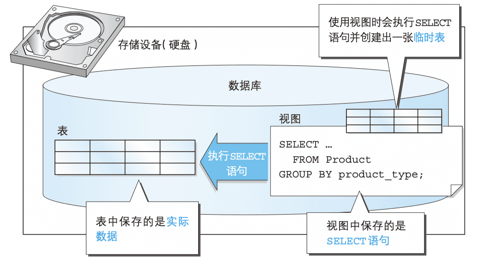

# SQL Learning

[TOC]

本笔记为阿里云天池龙珠计划SQL训练营的学习内容，链接为：https://tianchi.aliyun.com/specials/promotion/aicampsql


## DBMS

DBMS 主要通过数据的保存格式（数据库的种类）来进行分类，现阶段主要有以下 5 种类型.

- 层次数据库（Hierarchical Database，HDB）

- 关系数据库（Relational Database，RDB）

  > 这种类型的 DBMS 称为关系数据库管理系统（Relational Database Management System，RDBMS）。比较具有代表性的 RDBMS 有如下 5 种。

  - Oracle Database：甲骨文公司的RDBMS

  - SQL Server：微软公司的RDBMS

  - DB2：IBM公司的RDBMS

  - PostgreSQL：开源的RDBMS

  - MySQL：开源的RDBMS

- 面向对象数据库（Object Oriented Database，OODB）
- XML数据库（XML Database，XMLDB）
- 键值存储系统（Key-Value Store，KVS），举例：MongoDB


### RDBMS

#### SQL指令类型

使用 RDBMS 时，最常见的系统结构就是客户端 / 服务器类型（C/S类型）这种结构（图 1-3）


##### DDL

Data Definition Language，数据定义语言，用来创建或者删除存储数据用的数据库以及数据库中的表等对象。DDL 包含以下几种指令。

- CREATE ： 创建数据库和表等对象
- DROP ： 删除数据库和表等对象
- ALTER ： 修改数据库和表等对象的结构

##### DML

Data Manipulation Language，数据操纵语言，用来查询或者变更表中的记录。DML 包含以下几种指令。

- SELECT ：查询表中的数据
- INSERT ：向表中插入新数据
- UPDATE ：更新表中的数据
- DELETE ：删除表中的数据

##### DCL

Data Control Language，数据控制语言，用来确认或者取消对数据库中的数据进行的变更。除此之外，还可以对 RDBMS 的用户是否有权限操作数据库中的对象（数据库表等）进行设定。DCL 包含以下几种指令。

- COMMIT ： 确认对数据库中的数据进行的变更
- ROLLBACK ： 取消对数据库中的数据进行的变更
- GRANT ： 赋予用户操作权限
- REVOKE ： 取消用户的操作权限

##### SQL子句执行顺序

**FROM → WHERE → GROUP BY → HAVING → SELECT → ORDER BY**


#### 基本数据类型

- INTEGER 型

用来指定存储整数的列的数据类型（数字型），不能存储小数。

- CHAR 型

用来存储定长字符串，当列中存储的字符串长度达不到最大长度的时候，使用半角空格进行补足，由于会浪费存储空间，所以一般不使用。

- VARCHAR 型

用来存储可变长度字符串，定长字符串在字符数未达到最大长度时会用半角空格补足，但可变长字符串不同，即使字符数未达到最大长度，也不会用半角空格补足。

- DATE 型

用来指定存储日期（年月日）的列的数据类型（日期型）。


#### 约束的设置

约束是除了数据类型之外，对列中存储的数据进行限制或者追加条件的功能。

`NOT NULL`是非空约束，即该列必须输入数据。

`PRIMARY KEY`是主键约束，代表该列是唯一值，可以通过该列取出特定的行的数据。


#### 视图

视图是一个虚拟的表，不同于直接操作数据表，视图是依据SELECT语句来创建的（会在下面具体介绍），所以操作视图时会根据创建视图的SELECT语句生成一张虚拟表，然后在这张虚拟表上做SQL操作。

视图的存在主要有以下几点原因：

1. 通过定义视图可以将频繁使用的SELECT语句保存以提高效率。
2. 通过定义视图可以使用户看到的数据更加清晰。
3. 通过定义视图可以不对外公开数据表全部字段，增强数据的保密性。
4. 通过定义视图可以降低数据的冗余。

《*sql**基础**教程**第2版*》用一句话非常凝练的概括了视图与表的区别—“是否保存了实际的数据”。所以视图并不是数据库真实存储的数据表，它可以看作是一个窗口，通过这个窗口我们可以看到数据库表中真实存在的数据。所以我们要区别视图和数据表的本质，即视图是基于真实表的一张虚拟的表，其数据来源均建立在真实表的基础上。



*图片来源：《sql基础教程第2版》*

下面这句顺口溜也方便大家记忆视图与表的关系：“视图不是表，视图是虚表，视图依赖于表”。

视图不仅可以基于真实表，我们也可以在视图的基础上继续创建视图。


*图片来源：《sql基础教程第2版》*

虽然在视图上继续创建视图的语法没有错误，但是我们还是应该尽量避免这种操作。这是因为对多数 DBMS 来说， 多重视图会降低 SQL 的性能。

- 注意事项

需要注意的是在一般的DBMS中定义视图时不能使用ORDER BY语句。下面这样定义视图是错误的。

```sql
CREATE VIEW productsum (product_type, cnt_product)
AS
SELECT product_type, COUNT(*)
FROM product
GROUP BY product_type
ORDER BY product_type;
```

为什么不能使用 ORDER BY 子句呢？这是因为视图和表一样，**数据行都是没有顺序的**。

*在 MySQL中视图的定义是允许使用 ORDER BY 语句的，但是若从特定视图进行选择，而该视图使用了自己的 ORDER BY 语句，则视图定义中的 ORDER BY 将被忽略。*

##### 更新视图内容

因为视图是一个虚拟表，所以对视图的操作就是对底层基础表的操作，所以在修改时只有满足底层基本表的定义才能成功修改。

对于一个视图来说，如果包含以下结构的任意一种都是不可以被更新的：

- 聚合函数 SUM()、MIN()、MAX()、COUNT() 等。
- DISTINCT 关键字。
- GROUP BY 子句。
- HAVING 子句。
- UNION 或 UNION ALL 运算符。
- FROM 子句中包含多个表。

视图归根结底还是从表派生出来的，因此，如果原表可以更新，那么 视图中的数据也可以更新。反之亦然，如果视图发生了改变，而原表没有进行相应更新的话，就无法保证数据的一致性了。
