[TOC]

# Oracle数据库的使用

## 数据库相关概念

### 什么是数据库

所谓的数据库其实就是数据的集合。用户可以对集合中的数据进行新增、查询、更新、删除等操作。数据库是以一定方式储存在-起、能与多个用户共享、具有尽可能小的冗余度、与应用程序彼此独立的数据集合。

### 数据库类型

#### 关系型

- Oracle
- MySQL
- PostgreSQL
- DB2
- Microsoft SQL Server
- Microsoft Access

#### 非关系型

- Redis
- MongoDB
- Big Table

### 关系型数据库与非关系型数据之间的区别

#### 关系型数据库

##### 特点

- 关系型数据库最典型的数据结构是表，由二维表及其之间的联系所组成的一个数据组织。支持事务一致特性。 

##### 优点

- 易于维护：都是使用表结构，格式一致;
- 使用方便： SQL语言通用;
- 复杂操作：支持SQL，可用于一个表以及多个表之间非常复杂的查询;

##### 缺点

- 性能差：读写性能比较差，尤其是海量数据的高效率读写，传统关系型数据库来说，硬盘I/O是一个很大的瓶颈;
- 存储方式不灵活：固定的表结构，灵活度稍欠;

#### 非关系型数据库

##### 特点

- 非关系型数据库严格上不是一种数据库，应该是一种数据结构化存 储方法的集合，可以是文档或者键值对等。不支持事务一致特性。

##### 优点

- 格式灵活：存储数据的格式可以是key, value形式、文档形式、图片形式等等；
- 高扩展性：基于键值对，数据没有耦合性，容易扩展；
- 速度快：无需经过SQL层的解析，读写性能很高；

##### 缺点

- 不支持SQL：不提供SQL支持，学习和使用成本较高；
- 不支持事务：无事务处理能力；
- 不支持复杂查询：数据结构相对复杂，复杂查询方面稍欠；


## Oracle入门

### 什么是Oracle数据库

所有的关系型数据库存储数据的集合就是磁盘中的文件。Oracle数据库其实就是一组文件的集合。Oracle 数据库分别由：数据文件、控制文件、日志文件所构成。

#### 数据文件(.DBF)

数据文件是一个二进制文件，是用于保存用户应用程序数据和Oracle系统内部数据的文件，这些文件在操作系统中就是普通的操作系统文件。Oracle在创建表空间的同时会创建数据文件。

#### 控制文件(.CTL)

控制文件是一一个二进制文件，它主要记录数据库的名称、数据库的数据文件存放位置等信息。一个控制文件只能属于一个数据库。如果控制文件丢失，这数据库就无法操作。

#### 日志文件（.LOG)

日志文件在Oracle数据库中分为重做日志(Redo Log File)文件和归档日志文件两种。重做日志文件是Oracle数据库正常运行不可缺少的文件。重做日志文件主要记录了数据库操作过程。用于备份和还原数据库，以达到数据库的最新状态。

### 什么是 Oracle实例

实例就是数据库启动后分配的内存和建立的后台进程.数据库关闭后，物理上的文件还存在，但实例(分配的内存和建立的进程)就没有了

### Oracle 实例与数据库的关系

实例就是一组操作系统进程 (或者是一个多线程的进程) 以及一些内存。这些进程可以操作数据库；而数据库只是一个文件集合(包括数据文件、临时文件、重做日志文件和控制文件)。
在任何时刻，一个实例只能有一组相关的文件(与-个数据库关联)。大多数情况下，反过来也成立： 一个数据库.上只有一个实例对其进行操作。

### Oracle 版本说明

- Oracle 8i
- Oracle 9i
- Oracle 10g
- Oracle 11g
- Oracle 12c
- Oracle 18c
- Oracle 19c


- I： i代表 Internet 8i 版本开启对Internet的支持。所以，在版本号之后，添加了标识i。
- G： g代表Grid网格。10g 加入了网格计算的功能，因此版本号之后的标识使用了字母g。
- C： c代表云(cloud)计算设计。12c 版本表示对云计算的支持。


## Oracle的安装与卸载

### Oracle安装步骤


### Oracle 卸载步骤

#### 停止使用Oracle的服务

停用oracle服务，进入计算机管理，在服务中，找到oracle开头的所有服务，右击选择停止。

#### 运行卸载Oracle数据库程序

在开始菜单中找到Oracle 安装产品，点击运行Oracle自带的卸载程序Universal Installer工具卸载。

#### 删除使用Oracle的服务

开始菜单中，找到`Universal Installer`，运行`Oracle Universal Installer`，单击卸载产品，在产品清单窗口中，单击全部展开，除了`OraDb11g_home`外，勾选其他项目，单击删除，根据软件提示单击下一步最终完成卸载。

#### 删除注册表中Oracle相关项

在命令窗口，输入`regedit`，打开注册表，依次展开`HKEY_ LOCAL_MACHINE\SOFTWARE`，找到`oracle`，删除之。
依次展开`HKEY_LOCAL_MACHINE\SYSTEM\CurrentControlSet\Services`中，删除所有`oracle`开头的项。
依次展开`HKEY_LOCAL_MACHINE\SYSTEM\CurrentControlSet\Services\Eventlog\Application`，删除
所有`oracle`开头的项。
扩展删除(以下不是必须的注册表删除项) ，如果安装不成功可以自己也把这些删除了。在`HKEY_CLASSES_ROOT`，删除以`Ora`、`Oracle`、 `Orcl `或`EnumOra`为前缀的键删除`HKEY_CURRENT_USER\Software\Microsoft\Windows\CurrentVersion\Explorer\MenuOrder\StartMenu\Programs`中所有以`oracle `开头的键。
删除`HKEY_LOCAL_MACHINE\SOFTWARE\ODBC\ODBCINST.INI`中除`Microsoft ODBC for Oracle`注册表键以外的所有含有`Oracle`的键。

#### 删除Oracle环境变量

右键点击`我的电脑-->属性-->高级-->环境变量`，删除环境变量`ORACLE_HOME`、`TNS_ADMIN`等环境变量，删除`PATH`中等环境变量有关`Oracle`的设定的路径信息。

#### 删除“开始”菜单中Oracle目录

打开资源管理器，在地址栏中输入`%userprofile%\「开始」菜单\程序`回车，删除安装的`Oracle`目录。然后再到地址栏中输入`%allusersprofle%「开始」菜单\程序`回车，删除安装的`Oracle`目录。

#### 重新启动计算机

重启电脑。

#### 删除`Program Files\Orace`目录

如果在`Program Files\Oracle`目录存在，则删除`Program Files\Oracle`目录。

#### 删除Oracle安装目录

删除`Oracle`的安装目录`app`等目录。


## Oracle目录结构与系统用户

### Oracle目录结构


#### admin目录

记录Oracle实例的配置，运行日志等文件。每个实例一个目录。
SID: System IDentifer的缩写，是Oracle实例的唯一标记。 在Oracle中一个实例只能操作一个数据库。如果安装多个库那么就会有多个实例，我们可以通过实例SID来区分。由于Oracle中一个实例只能操作一个数据库的原因oracle中也会使用SID来作为库的名称。

#### cfgtoollogs目录

下面子目录分别存放当运行`dbca`, `emca`, `netca `等图形化配置程序时的`log`。

#### checkpoints目录

存放检查点文件

#### diag目录

Oracle11g新添加的一个重组目录。其中的子目录，基本上Oracle每个组件都有了自己单独的目录，在Oracle10g中我们一直诟病的log文件散放在四处的问题终于得到解决，无论是`asm`还是`crs`还是`rdbms `，所有组件需要被用来诊断的log文件都存放在了这个新的目录下。

#### flash_recovery_area(闪回区)目录

闪回区：分配一个特定的目录位置来存放一些特定的恢复文件，用于集中和简化管理数据库恢复工作。闪回区可存储完全的数据文件备份、增量备份、数据文件副本、当前的控制文件、备份的控制文件、spfile 文件、快照控制文件、联机日志文件、归档日志、块跟踪文件、闪回日志。

#### oradata目录

存放数据文件。

##### orcl数据库文件


#### 数据库中的文件介绍

- CONTROLO1.CTL

  - Oracle数据库的控制文件。

- EXAMPLE01.DBF

  - Oracle数据库表空间文件。

- REDO01.LOG

  - Oracle数据库的重做日志文件。

- SYSAUX01.DBF

  - 11g新增加的表空间。主要存储除数据字典以外的其他数据对象。由系统内部自动维护。

- SYSTEM01.DBF

  - 用于存放Oracle系统内部表和数据字典的数据。比如，表名、列名、用户名等。

- TEMP01.DBF

  - 临时表空间文件。

- UNDOTBSO1.DBF

  - 撤销表空间文件。用来保存回滚数据。

- USERSO1.DBF

  - 用户表空间。

#### product目录

Oracle RDBMS的软件存放目录。RDBMS即关系数据库管理系统(Relational Database
Management System)。

### Oracle系统用户

#### sys用户

sys: sys是Oracle中的超级账户，拥有的权限最大。可以完成数据库的所有管理任务。

#### system用户

system:没有sys权限大，通常用来创建一些用户查看管理信息的表或视图。不建议使用system用户来创建一些与管理无关的表或者视图。

#### 二者在登录时的区别

sys和system在登录Oracle时， sys只能以系统管理员(sysdba)或系统操作员(sysoper)的权限登录，而system可以直接登录(normal)。

#### scott用户

scott :是oracle 提供的示例用户，提供了一些学习 oracle 操作的数据表。如: emp、dept、salgrade、bonus 表

### Oracle 的启动与关闭

#### Oracle启动

Oracle是通过系统的服务来启动的。

##### `OracleServiceORCL`(必须启动)

`OracleServiceORCL`:数据库服务(数据库实例)，是Oracle核心服务该服务，是数据库启动的基础，只有该服务启动，Oracle 数据库才能正常启动。

##### `OracleOraDb11g_home1TNSListener`(必须启动)

`OracleOraDb11g_horme1TNSListener`:监听器服务，服务只有在数据库需要远程访问的时候或者使用PLSQL Developer 等第三方工具时才需要。.

##### Oracle ORCL VSS Writer Service(非必须启动)

Oracle ORCL VSS Writer Service: Oracle 卷映射拷贝写入服务，VSS(Volume Shadow Copy Service)能够让存储基础设备(此如磁盘，阵列等)创建高保真的时间点映像，即映射拷贝(shadow copy)。 它可以在多卷或者单个卷上创建映射拷贝，同时不会影响到系统的系统能。

##### `OracleDBConsoleorcl`(非必须启动)

`OracleDBConsoleorcl` : Oracle 数据库控制台服务， orcl 是Oracle的实例标识，默认的实例为`orcl`。 在运行Enterprise Manager(企业管理器 OEMD的时候，需要启动这个服务。

##### `OracleJobSchedulerORCL`(非必须启动)

`OracleJobSchedulerORCL`: Oracle 作业调度(定时器)服务， ORCL是Oracle实例标识。

##### `OracleMTSRecoveryService`(非必须启动)

`OracleMTSRecoveryService`:服务端控制。该服务允许数据库充当-个微软事务服务器MTS、COM/COM+对象和分布式环境下的事务的资源管理器。

#### Oracle 关闭

关闭Oracle只需要将服务停止即可。

### Oracle客户端工具介绍

#### Oracle自带客户端工具SQL Plus


sys用户登录命令: `sys as sysdba | sysoper`
system用户登录命令: system

#### Oracle 第三方工具PL/SQL Developer

##### 安装PL/SQL Developer


###### Command Window


###### SQL Window


### Oracle 的使用

#### Oracle 的表空间

##### Oracle的表空间分类

###### 永久表空间

表空间是数据库的逻辑划分,一个表空间只能属于一个数据库。所有的数据库对象都存放在指定的表空间中。但主要存放的是表，所以称作表空间。

###### 临时表空间

Oracle临时表空间主要用来做查询和存放一些缓冲区数据。临时表空间消耗的主要原因是需要对查询的中间结果进行排序。重启数据库可以释放临时表空间。

##### 创建永久表空间命令

````sql
create tablespace 永久表空间名称 datafile '永久表空间物理文件位置' size 15M autoextend on next 10M permanent online;
````

#### 创建用户

##### 通过PL/SQL Developer 工具创建用户

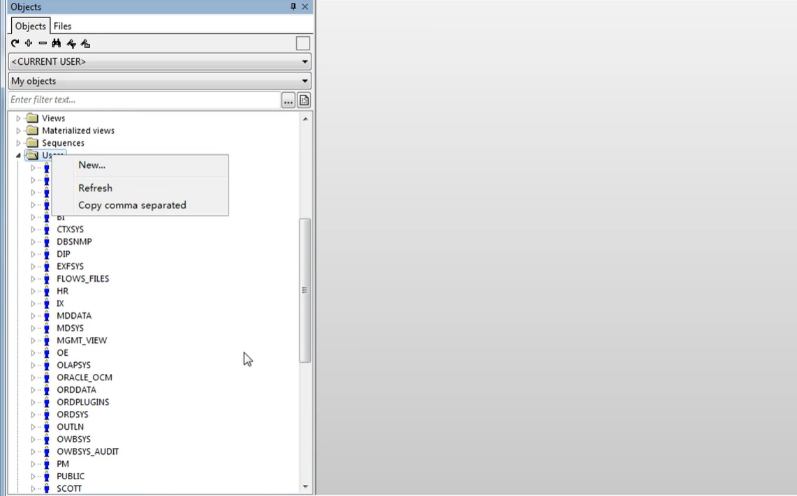

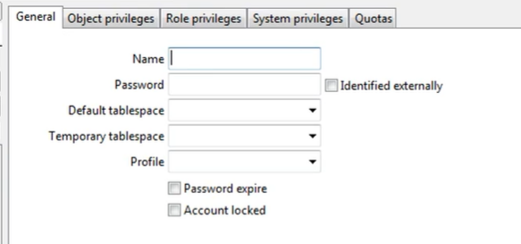


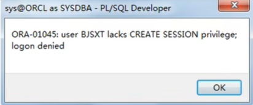

#### 分配用户权限

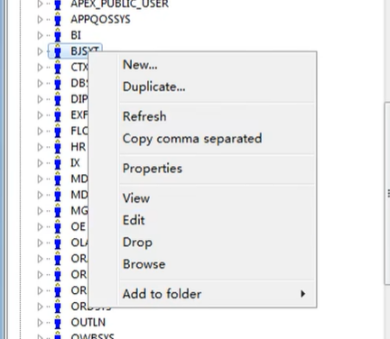

##### 对象权限[Object privileges)

对象权限是指在指定的表视图序列上制定执行动作的权限或权利。

##### 角色权限(Role privileges)

角色是可以授予用户的相关权限的组，该方法使权限的授予撤回更加容易管理。

##### 系统权限[System privileges)

为用户分配创建表、创建用户、创建视图、创建存储过程等权限。

#### 分配链接权限

为当前用户分配一个connect链接角色

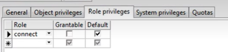

#### 分配系统权限

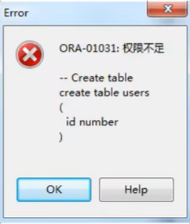

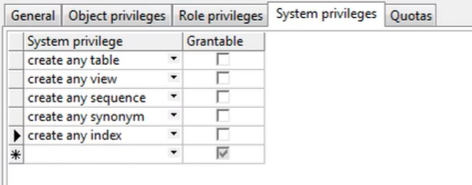

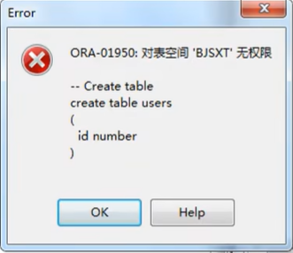

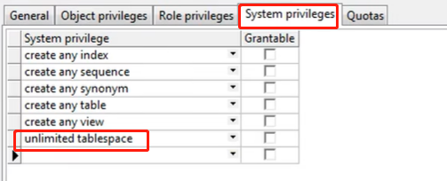

### Oracle 的链接配置

#### 文件位置

`Oracle目录\product\11.2.0\dbhome_1\NETWORK\ADMIN`

#### sqlnet.ora

名称解析。通过这个文件来决定怎么样找-一个连接中出现的连接字符串。
如： `sqlplus bjsxt/oracle@orcl`
`NAMES.DIRECTORY_PATH=(TNSNAMES, EZCONNECT)`

#### tnsnames.ora

用在oracle client端，用户配置连接数据库的别名参数就像系统中的hosts文件- -样。

- ORCL
  - 客户端连接服务器端使用的服务别名。注意一定要顶行书写，否则会无法识别服务别名。
- PROTOCOL
  - 客户端与服务器端通讯的协议，一般为TCP,该内容一般不用改。
- HOST
  - ORACLE服务器端IP地址或者`hostname`。确保服务器端的监听启动正常。
- Port
  - 数据库侦听正在侦听的端口，此处port的值一定要与数据库侦听正在侦听的端口一样。

#### listener.ora

用在oracle server端，可配置Oracle的监听端口

- LISTENER
  - 监听名称，可以配置多个监听,多个监听的端口号要区分开来。
- PROTOCOL
  - 监听协议，一般都使用TCP。
- HOST
  - 本机IP地址或者localhostname
- PORT
  - 监听的端口号

### Net Configuration Assistant工具

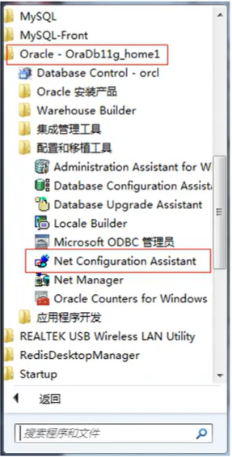

#### 配置监听程序

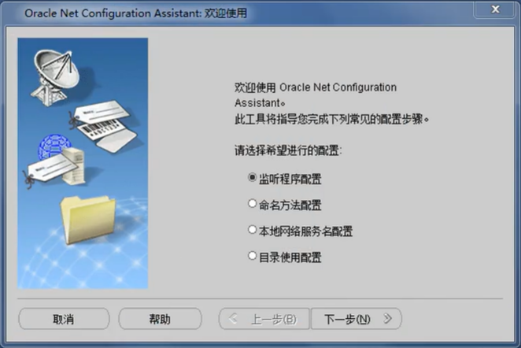

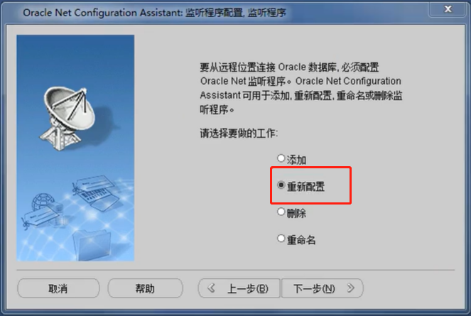

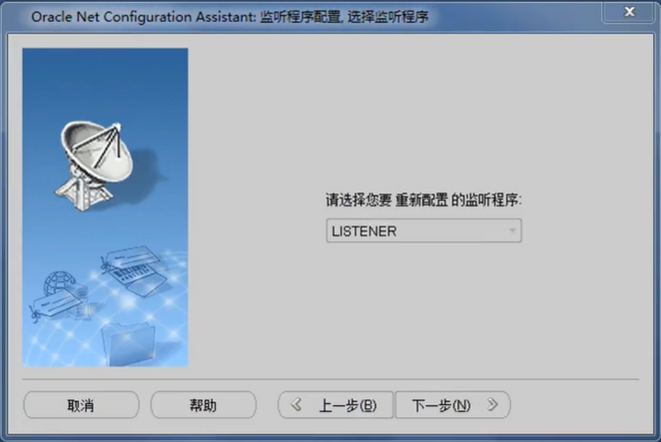

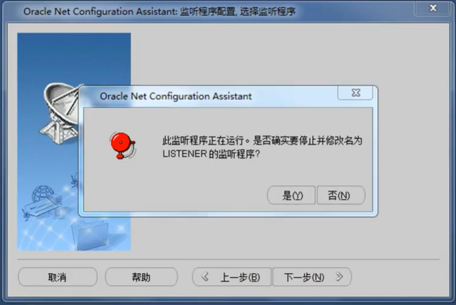

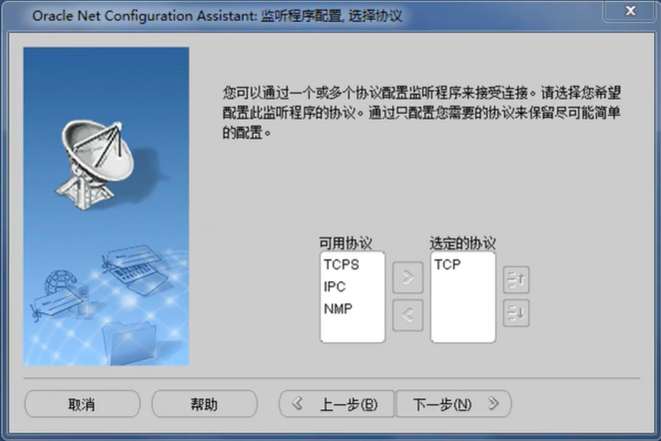

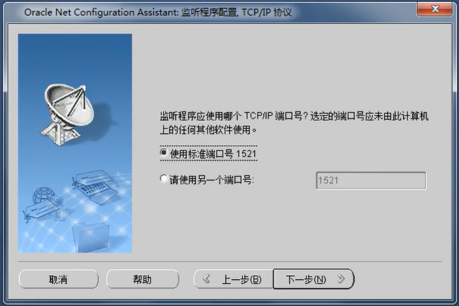

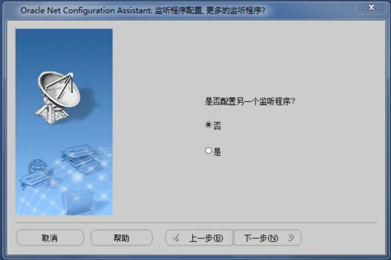

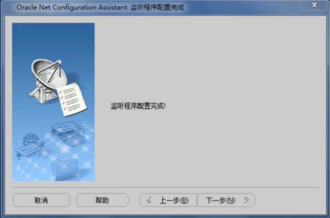

#### Oracle本地网络服务配置

##### 1配置本地网络服务要求:

1. 防火墙需要关闭
2. 相互是可ping通的

##### 配置方式

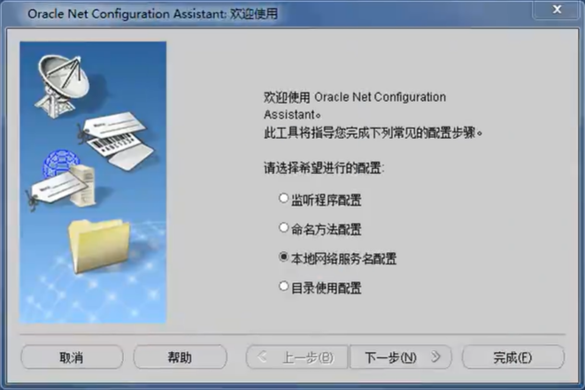

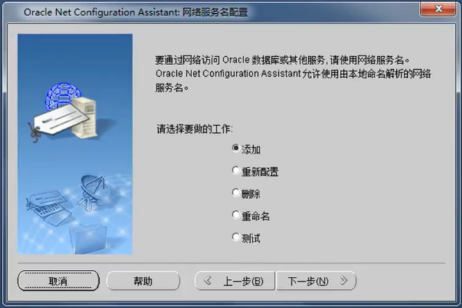

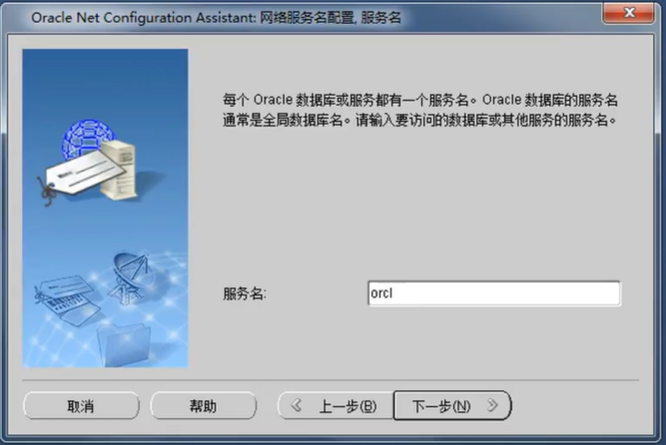


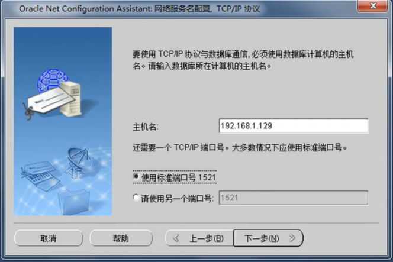

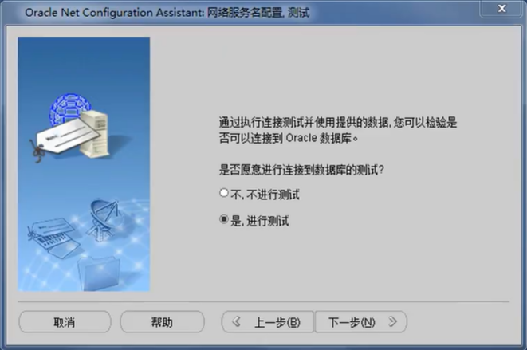

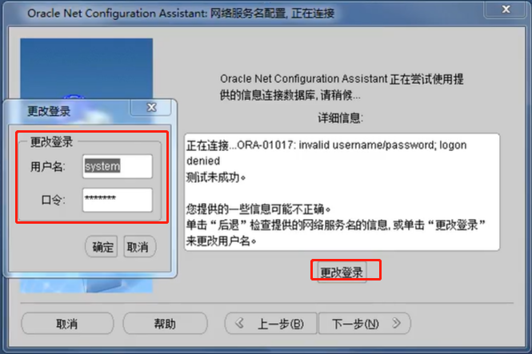

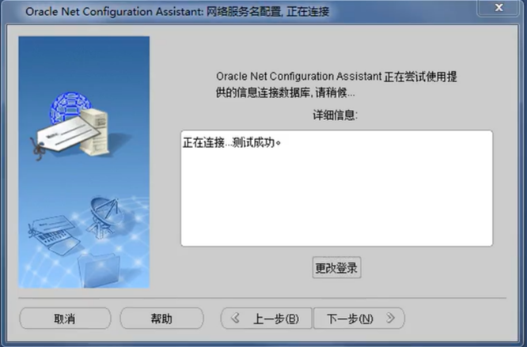

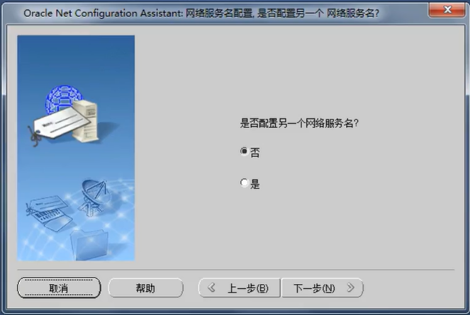

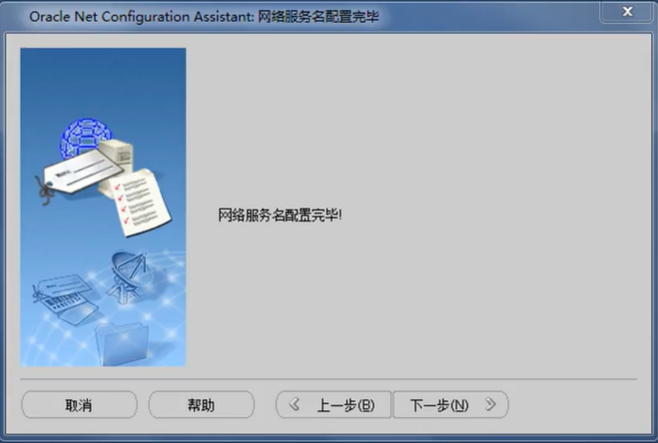

### Oracle 基本操作

#### Oracle 中的数据类型

##### 字符类型

字符串数据类型还可以依据存储空间分为固定长度类型(CHAR)和可变长度类型(VARCHAR2/NVARCHAR2)两种。

- CHAR类型
  - CHAR类型，定长字符串，会用空格填充来达到其最大长度。非NULL的CHAR(12)总是包含12字节信息。CHAR字段最多可以存储2000字节的信息。如果创建表时，不指定CHAR长度，则默认为1。
- VARCHAR2类型
  - 变长字符串，与CHAR类型不同，它不会使用空格填充至最大长度。VARCHAR2最多可以存储4000字节的信息。
- NVARCHAR2类型
  - 这是一个包含UNICODE格式数据的变长字符串。NVARCHAR2 最多可以存储4000字节的信息。

##### 数字类型

- NUMBER类型
  - NUMBER(P,S)是最常见的数字类型。
  - P是Precision的英文缩写，即精度缩写，表示有效数字的位数，最多不能超过38个有效数字。
  - S是Scale的英文缩写，表示小数点数字的位数。
- INTEGER类型
  - INTEGER是NUMBER的子类型，它等同于NUMBER (38,0) ，用来存储整数。若插入、更新的数值有小数，则会被四舍五入。

##### 浮点数

- BINARY_FLOAT类型
  - BINARY_FLOAT是32位、单精度浮点数字数据类型。可以支持至少6位精度每个BINARY_FLOAT的值需要5个字节，包括长度字节。
- BINA RY DOUBLE
  - BINARY_DOUBLE是为64位，双精度浮点数字数据类型。每个BINARY_DOUBLE的值需要9个字节，包括长度字节。

##### 日期类型

- DATE类型
  - DATE是最常用的数据类型，日期数据类型存储日期和时间信息。虽然可以用字符或数字类型表示日期和时间信息，但是日期数据类型具有特殊关联的属性。为每个日期值，Oracle存储以下信息：世纪、年、月、日期、小时、分钟和秒。一般占用7个字节的存储空间。
- TIMESTAMP类型
  - 这是一个7字节或12字节的定宽日期时间数据类型。它与DATE数据类型不同，因为TIMESTAMP可以包含小数秒，带小数秒的TIMESTAMP在小数点右边最多可以保留9位。
- TIMESTAMP WITH TIME ZONE类型
  - 这是TIMESTAMP类型的变种，它包含了时区偏移量的值。
- TIMESTAMP WITH LOCAL TIME ZONE类型
  - 将时间数据以数据库时区进行规范化后进行存储

##### LOB类型

- CLOB类型(Character Large Object)
  - 二进制数据，存储单字节和多字节字符数据。最大长度4G。

- BLOB类型(Binary Large Object)
  - 它存储非结构化的二进制数据大对象，它可以被认为是没有字符集语义的比特流，一般是图像、声音、视频等文件。最大长度4G。
- NCLOB数据类型
  - 存储UNICODE类型的数据，最大长度4G。

##### LONG & RAW & LONG RAW类型

- LONG类型
  - 它存储变长字符串(超长字符串),最多达2G的字符数据(2GB是指2千兆字节，而不是2千兆字符)。
- LONG RAW类型
  - 能存储2GB的原始二进制数据，可存放多媒体图象声音等。
- RAW类型
  - 用于存储二进制或字符类型数据,必须制定长度。这种数据类型存储的数据不会发生字符集转换。可存放多媒体图象声音等。

#### 在Oracle中创建表

##### Oracle表名命名规则

- 必须以字母开头
- 长度不能超过30个字符
- 避免使用Oracle的关键字
- 只能使用A-Z、a-z、0-9、#$

##### 使用带有特殊符号的表名

Oracle在创建表时，表名会自动转换大写。Oracle 对表名大小写不敏感。
如果在定义表名时含有特殊符号，或者用小写字母来定义表名则需要在表名两侧添加双引号。

#### 数据库中的约束

##### 约束的作用

约束用于规定表中的数据规则，如果存在违反约束的数据行为，行为会被约束终止。

##### 约束类型

- 主键约束(Primary Key Constraint)
  - 唯一性，非空性。
- 唯一约束(Unique Constraint)
  - 唯一性，可以空，但只能有一个。
- 检查约束(Check Constraint)
  - 对该列数据的范围、格式的限制(如：年龄、性别等)。
- 非空约束(Not Null Constraint)
  - 该列不允许包含空值。
- 外键约束(Foreign Key Constraint)
  - 需要建立两表间的关系并引用主表的列。

#### 数据库中表关系

设计关系数据库的一个重要部分是将数据元素划分为相关的表，我们可以根据数据本身的关联性，将不同表之间的数据聚合在一起。 注意：无论在表与表之间建立了什么样的关系，决定数据之间是否有关系的不是表，而是数据本身。
表与表之间一般存在三种关系，即一对一，一对多，多对多关系。

##### 一对多

一对多关系是建立在两张表之间的关系。一个表中的一条数据可以对应另一个表中的多条数据。记住：外键永远在多方。外键允许重复，允许含有空值。

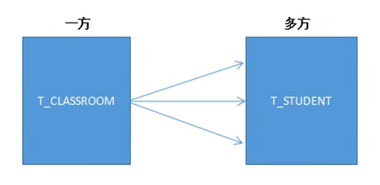

- T_CLASSROOM

  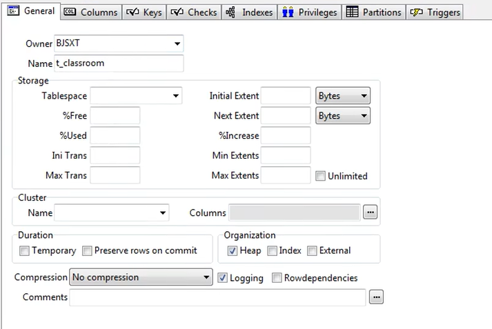

  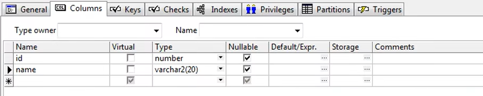

  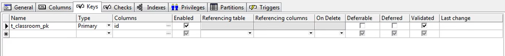

- T_STUDENT

  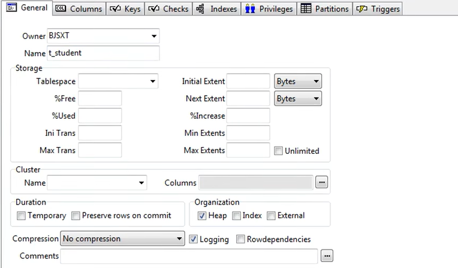

  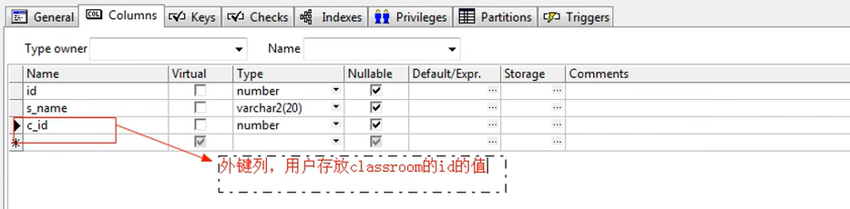

  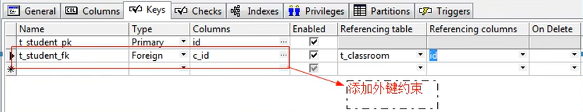

##### 一对一

一对一关系是建立在一对多的基础之上，外键可以在任何一方，需要让外键一方具备唯一约束

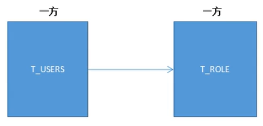

- T_USER

  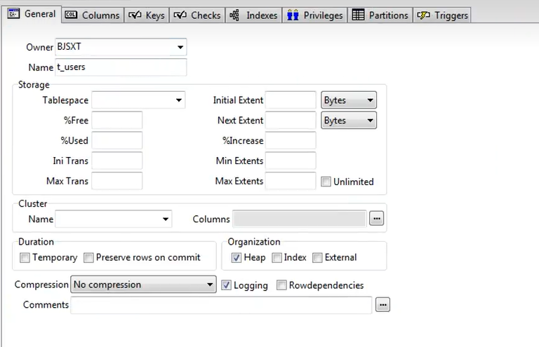

  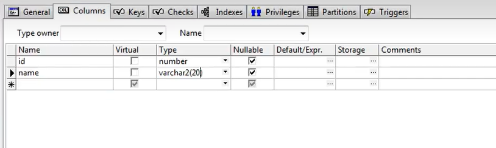

  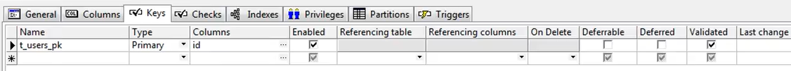

- T_ROLE

  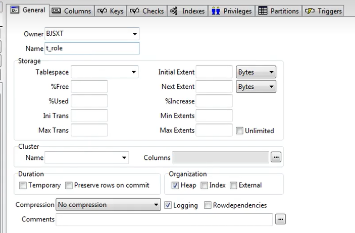

  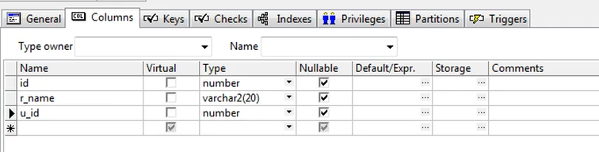

  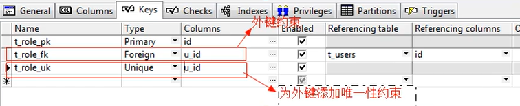

##### 多对多

需要建立一个中间表，中间表里放两个表的主键，然后需要用这两个列作为这个表的联合主键，然后每个列在作为外键参照各自的表的主键

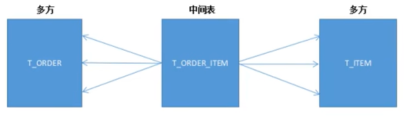

- T_ORDER

  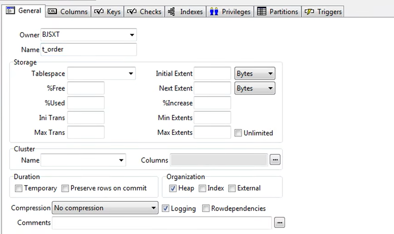

  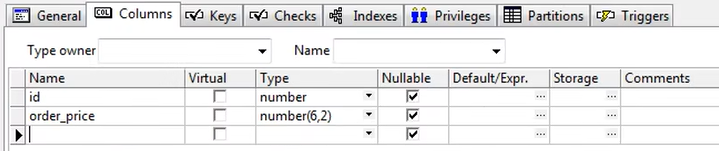

  

- T_ORDER_ITEM

  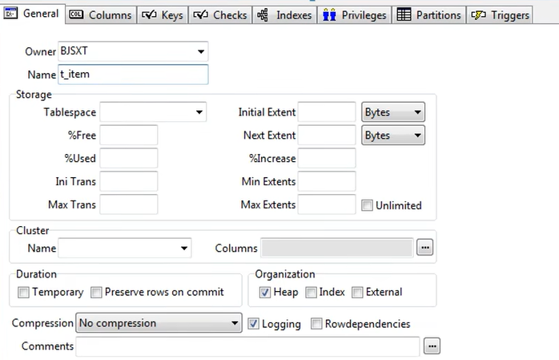

  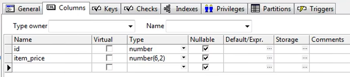

  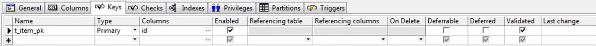

- T_ITEM

  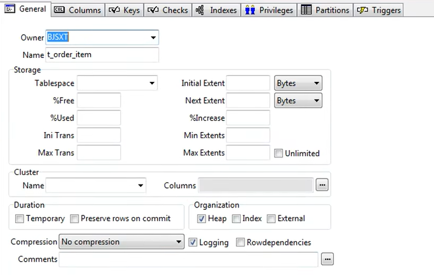

  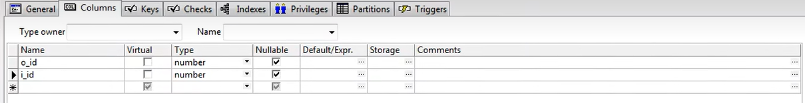

  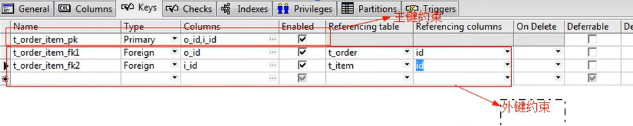

### 
