# 学习记录文档

[toc]

## 一、Develop

### 1、Node.js 相关

#### 1.1.1 nodeJS 的 npm 设置国内高速镜像之淘宝镜像的方法

1、我们知道 nodeJS 是老外搞出来的，服务器放在了国外，国内的小朋友访问起来会比较慢，阿里巴巴的淘宝给出了有力支持，现在我们就将 nodeJS 的镜像地址切换为国内的淘宝镜像。

2、查看当前的镜像地址：
　　`npm get registry`
　　得到
　　`https://registry.npmjs.org/`

3、在 CMD 中执行如下命令，配置注册的镜像地址为淘宝镜像：
　　`npm config set registry http://registry.npm.taobao.org/`
　　或
　　`yarn config set registry http://registry.npm.taobao.org/`

4、如果想换回来的话将淘宝镜像再换成 `https://registry.npmjs.org/` 即可：
　　`npm config set registry https://registry.npmjs.org/`

5、备注：
　　NPM = NodeJS Package Manager

#### 1.1.2 建议安装的包

- nrm：镜像源管理工具
- create-react-app：react项目创建工具
- vue-cli：Vue.js 开发的标准工具


### 2、Vue 学习

```bash
# 全局安装 vue-cli
$ cnpm install --global vue-cli
# 创建一个基于 webpack 模板的新项目
$ vue init webpack my-project
# 这里需要进行一些配置，默认回车即可
This will install Vue 2.x version of the template.

For Vue 1.x use: vue init webpack#1.0 my-project

? Project name my-project
? Project description A Vue.js project
? Author runoob <test@runoob.com>
? Vue build standalone
? Use ESLint to lint your code? Yes
? Pick an ESLint preset Standard
? Setup unit tests with Karma + Mocha? Yes
? Setup e2e tests with Nightwatch? Yes

   vue-cli · Generated "my-project".

   To get started:
   
     cd my-project
     npm install
     npm run dev
   
   Documentation can be found at https://vuejs-templates.github.io/webpack
```

```base
$ cd my-project
$ cnpm install
$ cnpm run dev
 DONE  Compiled successfully in 4388ms

> Listening at http://localhost:8080
```

#### 1.2.1 一些有用的依赖

- `npm config set registry https:*//registry**.npm**.taobao**.org*`  更换源至淘宝
- `npm install-g cnpm --registry=https://registry.npm.taobao.org ` 设置淘宝镜像
- `cnpm install express` express
- `cnpm install webpack -g` 安装webpack
- `cnpm install vue-cli -g` vue脚手架
- `cnpm install axios -S` axios
- `cnpm install element-ui -S` elementUI
- `cnpm install less less-loader --save-dev`
- `npm install vuex --save`
- `cnpm install babel-polyfill`  -- 解决白屏问题 
- `cnpm install ex6-promise`
- `npm install css-loader style-loader –save-dev`

#### 1.2.2 项目打包

`npm run build`
执行完后会在项目中下生成`dist`目录，一般包含 index.html 文件及 static 目录，static 目录包含了静态文件 js、css 以及图片目录 images。

#### 1.2.3 项目结构

| build        | 项目构建(webpack)相关代码                                    |
| ------------ | ------------------------------------------------------------ |
| config       | 配置目录，包括端口号等。我们初学可以使用默认的。             |
| node_modules | npm 加载的项目依赖模块                                       |
| src          | 这里是我们要开发的目录，基本上要做的事情都在这个目录里。里面包含了几个目录及文件：assets: 放置一些图片，如logo等。components: 目录里面放了一个组件文件，可以不用。App.vue: 项目入口文件，我们也可以直接将组件写这里，而不使用 components 目录。main.js: 项目的核心文件。 |
| static       | 静态资源目录，如图片、字体等。                               |
| test         | 初始测试目录，可删除                                         |
| .xxxx文件    | 这些是一些配置文件，包括语法配置，git配置等。                |
| index.html   | 首页入口文件，你可以添加一些 meta 信息或统计代码啥的。       |
| package.json | 项目配置文件。                                               |
| README.md    | 项目的说明文档，markdown 格式                                |


### 3、后端mod(%)取模运算符的算法

例如a % b


### 4、Spring boot 和 Spring Cloud 各个版本对应关系

| spring cloud        | spring boot                                   |
| ------------------- | --------------------------------------------- |
| Finchley            | 2.0.x                                         |
| Finchley.SR1        | Spring Boot >=2.0.3RELEASE and <=2.0.9RELEASE |
| Finchley.SR4        | Spring Boot >=2.0.3RELEASE and <=2.0.9RELEASE |
| Greenwich           | 2.1.x                                         |
| Hoxton              | 2.2.x , 2.3.x(Starting with SR5)              |
| 2020.0.x aka Ilford | 2.4.x                                         |


### 5、缓存技术之session缓存管控

​	Session是服务器端使用的一种记录客户端状态的机制，一般Session存储在服务器的内存中，tomcat的StandardManager类将session存储在内存中；客户端只保存sessionID到cookie中，而不会保存session，session销毁只能通过invalidate或超时（默认30分钟），关掉浏览器并不会关闭session。当程序需要为某个客户端的请求创建一个session时，服务器首先检查这个客户端的请求里是否包含一个session标识（即sessionID）。如果已经包含一个sessionID说明以前已经为此客户端创建过session，服务器就按照sessionID把这个session检索出来使用。

​	如果客户请求不包含sessionID，则为此客户创建一个session并且生成一个与此session相关的sessionID，这个sessionID将在本次响应中返回给客户端保存。

Session缓存优势明显，在日常开发过程中，大家基于这个优势，不可避免地存在session过度使用的情况，导致缓存未能正确清理，造成其他业务的误使用，从而引发一些业务问题，严重时可导致业务受理异常或业务数据不一致，比如下面的场景：

.jpg)

​	1、由于session缓存的生命周期较长，当操作员同时打开多个tab页时，A业务保存的缓存，B业务也能取到，被错误使用。只对某业务自己使用的信息，直接用同一个key来设值，被其他业务误用：

​	2、缓存使用完后未清理，或者在清理之前业务有异常导致未能正确清理缓存，会有多余的缓存信息残留，被其他业务错误使用。缓存使用完后应该及时清理，并且需要考虑在异常情况下是否也可以正确清理：

​	从使用session导致的问题看，严重时直接造成业务受理不正确，造成业务受理风险甚至生产故障，影响客户满意度。基于以上问题，在页面使用session的过程中，建议遵循以下原则：

​	1、只有页面全局通用的信息，再考虑是否有必要使用session缓存的方式来处理。

​	2、对于具体的业务菜单尽量不要使用，换其他的方式解决：

​		a) （推荐）本业务的所有信息都在handler里面处理，涉及到调用外部方法时，最安全的办法是使用Map传递值。

​		b) （不推荐）如果必须使用session缓存才能实现，缓存key值必须关联号码和菜单ID（建议的key格式XXXX_billId_menuId）。


### 6、在Idea中打包项目

+ 打开Project Structure界面(快捷键是F4或者F12)  选择Artifacts一栏
+ 点击＋号后选择`Web Application: Exploded`下的From Modules
+ 点击＋号后选择 `Web Application: Archive`下的For ***
+ 在右侧Name：一栏中修改名字  点击Apply和OK
+ 选择菜单栏上的Build下的Build Artifacts
+ 选择后缀之后War的那一个，之后点击Build，等待完成
+ 再打开Project Structure界面，查看Output directory一栏后的War包所在路径


### 7、Java中正则的妙用 - 组

 *  PROCESSING_EMAIL_HTML_IMAGE_REGEX 常量中的每一个括弧为一个组
 *  PROCESS_EMAIL_HTML_IMAGE_REGEX_REPLACEMENT_PLACEHOLDER 常量中的$1 $3 $5代表上上面的第1个、第3个、第5个组
 *  processContentHTMLImageTag方法则是将 PROCESSING_EMAIL_HTML_IMAGE_REGEX 常量中的第1个、第3个、第5个组给摘出来，即删除第2、第4组

```java
public class Regular {
    public static final String PROCESSING_EMAIL_HTML_IMAGE_REGEX = "(src=\\\")(cid:)([\\w\\d]+\\.[A-Za-z]+)(@[A-Za-z0-9]+\\.[A-Za-z0-9]+)(\\\")";
    public static final String PROCESS_EMAIL_HTML_IMAGE_REGEX_REPLACEMENT_PLACEHOLDER = "$1$3$5";

    public String processContentHTMLImageTag(String contentText) {
        return contentText.replaceAll(
                MailConstants.PROCESSING_EMAIL_HTML_IMAGE_REGEX,
                MailConstants.PROCESS_EMAIL_HTML_IMAGE_REGEX_REPLACEMENT_PLACEHOLDER
        );
    }
}
```


### 8、Gradle学习

#### 常见的项目构建工具

- Ant: 
  - 优点: 使用灵活，速度快(快于 gradle 和 maven)
  - 缺点:Ant没有强加任何编码约定的项目目录结构,开发人员需编写繁杂 XML 文件构建指令,对开发人员是一个挑战
- Maven
  - 优点: 遵循一套约定大于配置的项目目录结构，使用统一的 GAV 坐标进行依赖管理,侧重于包管理
  - 缺点: 项目构建过程僵化,配置文件编写不够灵活、不方便自定义组件,构建速度慢于 gradle
- Gradle
  - 优点:集 Ant 脚本的灵活性+Maven 约定大于配置的项目目录优势,支持多种远程仓库和插件,侧重于大项目构建
  - 缺点: 学习成本高、资料少、脚本灵活、版本兼容性差等


#### Gradle安装

[SpringBoot 官方文档](https://docs.spring.io/spring-boot/docs/2.5.0/gradle-plugin/reference/htmlsingle/#getting-started)明确指出,目前 SpringBoot 的 Gradle 插件需要 gradle6.8 版本及以上，所以我们这里选择 7x 版本

其中SpringBoot与Gradle存在版本兼容问题，Gradle与Idea也存在兼容问题，所以要选择Gradle6.8版本以及高于6.8版本的Gradle	

**Important Tips：**

- 打开Idea安装目录下的\plugins\gradle\lib，能查看Idea与Gradle相对应的Gradle版本号
- 选择Spring Boot时一定要注意Spinrg Boot 和JDK 的版本

具体安装步骤参考以下文档：

- [官方文档](https://gradle.org/install/)
- [Gradle环境配置](https://zhuanlan.zhihu.com/p/522238682)

#### Gradle和Maven项目结构


#### 修改Maven下载源

我们可以在gradle的init.d目录下创建以.gradle结尾的文件，.gradle文件可以实现在build开始之前执行，所以可以在这个文件配置一些你要预先加载的操作

将以下内容复制到init.d目录下的init.gradle文件中：

- 项目所需要的架包会前往repositories中区下载
- 而buildscript是给build.gradle使用的
- mavenLocal() 即为maven本地仓库
- mavenCentral() 即为maven重要仓库

```groovy
allprojects {
    repositories {
        mavenLocal()
        maven { name "Alibaba"; Url "https://maven.aliyun.com/repository/public"}
        maven { name "Bstek"; Url "https://nexus.bsdn.org/content/groups/public"}
        mavenCentral()
    }
    
    buildscript {
        repositories {
        	maven { name "Alibaba"; Url "https://maven.aliyun.com/repository/public"}
        	maven { name "Bstek"; Url "https://nexus.bsdn.org/content/groups/public"}
        	maven { name "M2"; Url "https://plugins.gradle.org/m2/"}
        }
    }
}
```

<h5>启用init.gradle文件的方法：</h5>

1. 在命令行指定文件，例如：`gradle -init-script yourdir/init,gradle -q taskName`。你可以多输入此命令来指定多个init文件
2. 把init.gradle文件放到 USER_HOME/.gradle/ 目录下（即放到C盘下的当前用户目录下的.gradle文件夹下）
3. 把以.gradle结尾的文件放到 USER_HOME/.gradle/init.d/ 目录下（即放到C盘下的当前用户目录下的.gradle文件夹下的init.d文件夹下）
4. 把以.gradle结尾的文件放到 GRADLE_HOME/init.d/ 目录下（即gradle安装目录下的init.d文件夹下）

如果以上四种方式，存在两种，那么gradle会按照上面的顺序从1到4依次执行，如果给定目录下存在多个init脚本，会按拼音a-z顺序执行这些脚本，每个init脚本都存在一个对应的gradle实例，你在这个文件中调用的所有方法和属性，都会委托给这个gradle实例，每个init脚本都实现了Script接口。


## 二、Database


### 1、MySQL修改账号远程登陆权限

- 方法一：
  - `use mysql;`
  - `update user set host='%' where user='root';`
- 方法二：
  - `grant all privileges on *.* to 'root'@'%' identififed by '密码' with grant option;`

- 然后 `flush privileges;` 刷新权限


### 2、MySQL管理

#### 优化相关建议

- MySQL会使用索引的操作符号

    - <,<=,>=,>,=,between
    - 不带%或者_开头的like
    
- 使用索引的缺点

    - 减慢增删改数据的速度；
    - 占用磁盘空间；
    - 增加查询优化器的负担；
    - 当查询优化器生成执行计划时，会考虑索引，太多的索引会给查询优化器增加工作量，导致无法选择最优的查询方案；
    
- 分析索引效率

  - 方法：在一般的SQL语句前加上explain；
  - 分析结果的含义：
    - table：表名；
    - type：连接的类型，(ALL/Range/Ref)。其中ref是最理想的
    - possible_keys：查询可以利用的索引名
    - key：实际使用的索引
    - key_len：索引中被使用部分的长度（字节）
    - ref：显示列名字或者"const"
    - rows：显示MySQL认为在找到正确结果之前必须扫描的行数
    - extra：MySQL的建议；
- 数据表使用较短的定长列
  - 尽可能使用较短的数据类型；
  - 尽可能使用定长数据类型；
    - 用char代替varchar，固定长度的数据处理比变长的快些；
    - 对于频繁修改的表，磁盘容易形成碎片，从而影响数据库的整体性能；
    - 万一出现数据表崩溃，使用固定长度数据行的表更容易重新构造。使用固定长度的数据行，每个记录的开始位置都是固定记录长度的倍数，可以很容易被检测到，但是使用可变长度的数据行就不一定了；
    - 对于MyISAM类型的数据表，虽然转换成固定长度的数据列可以提高性能，但是占据的空间也大；

- 使用not null和enum

  - 尽量将列定义为not null，这样可使数据的出来更快，所需的空间更少，而且在查询时，MySQL不需要检查是否存在特例，即null值，从而优化查询；

  - 如果一列只含有有限数目的特定值，如性别，是否有效或者入学年份等，在这种情况下应该考虑将其转换为enum列的值，MySQL处理的更快，因为所有的enum值在系统内都是以标识数值来表示的；


- 使用optimize table
  - 对于经常修改的表，容易产生碎片，使在查询数据库时必须读取更多的磁盘块，降低查询性能。
  - 具有可变长的表都存在磁盘碎片问题，这个问题对blob数据类型更为突出，因为其尺寸变化非常大。
  - 可以通过使用optimize table来整理碎片，保证数据库性能不下降，优化那些受碎片影响的数据表。 
  - optimize table可以用于MyISAM和BDB类型的数据表。实际上任何碎片整理方法都是用mysqldump来转存数据表，然后使用转存后的文件并重新建数据表；

- 使用procedure analyse()
  - 使用procedure analyse()显示最佳类型的建议，使用很简单，在select语句后面加上procedure analyse()就可以了；例如：
    - select * from students procedure analyse();
    - select * from students procedure analyse(16,256);
  - 第二条语句要求procedure analyse()不要建议含有多于16个值，或者含有多于256字节的enum类型，如果没有限制，输出可能会很长；

- 使用查询缓存
  - 查询缓存的工作方式：
    第一次执行某条select语句时，服务器记住该查询的文本内容和查询结果，存储在缓存中，下次碰到这个语句时，直接从缓存中返回结果；当更新数据表后，该数据表的任何缓存查询都变成无效的，并且会被丢弃。
  - 配置缓存参数：
    变量：query_cache _type，查询缓存的操作模式。有3中模式，0：不缓存；1：缓存查询，除非与 select sql_no_cache开头；2：根据需要只缓存那些以select sql_cache开头的查询； query_cache_size：设置查询缓存的最大结果集的大小，比这个值大的不会被缓存。

- 调整硬件
  - 在机器上装更多的内存；
  - 增加更快的硬盘以减少I/O等待时间；
    寻道时间是决定性能的主要因素，逐字地移动磁头是最慢的，一旦磁头定位，从磁道读则很快；
  - 在不同的物理硬盘设备上重新分配磁盘活动；
  - 如果可能，应将最繁忙的数据库存放在不同的物理设备上，这跟使用同一物理设备的不同分区是不同的，因为它们将争用相同的物理资源（磁头）。


#### MySQL命令

##### 系统相关

- 查询时间

```mysql
select now();
```

- 查询当前用户

```mysql
select user();
```

- 查询数据库版本：

```mysql
select version();
```

- 查询当前使用的数据库：

```mysql
select database();
```

- 查看sql查询效率

```mysql
explain select * from t3 where id=3952602;
```

- 列出数据库

```mysql
show databases;
```

- 选择数据库

```mysql
use databaseName;
```

- 列出表格

```mysql
show tables;
```


##### 查询相关

- 联合字符或者多个列(将列id与":"和列name和"="连接)

```mysql
select concat(id,':',name,'=') from students;
```

- limit：选出10到20条

```mysql
select * from students order by id limit 9,10;
```


##### 索引相关

- 创建索引

```mysql
alter table table1 add index ind_id (id);
create index ind_id on table1 (id);
-- 建立唯一性索引
create unique index ind_id on table1 (id);
```

- 删除索引

```mysql
drop index idx_id on table1;
alter table table1 drop index ind_id;
```


##### 用户相关

- 增加新用户

```mysql
-- 普通创建用户并设置连接方式
CREATE USER 'test1'@'localhost' IDENTIFIED BY 'test1';
-- 赋予账号管理员权限
grant all on *.* to 'weihu'@'%' with grant option;
-- 创建用户并赋予权限
grant select on 数据库.* to 用户名@登录主机 identified by "密码"

-- 增加一个用户test密码为123，让他可以在任何主机上登录， 并对所有数据库有查询、插入、修改、删除的权限。
grant select,insert,update,delete on *.* to test Identified by "123";
-- 增加一个管理员用户
-- 如果报错最好使用先创建普通用户，然后去赋予管理员权限的方式
grant all on *.* to user@localhost identified by "password";
-- 最后刷新权限
flush privileges;
```

- 修改密码

```mysql
-- 命令行方式
-- mysqladmin -u用户名 -p旧密码 password 新密码
-- sql的方式
update user set password=password('521') where user='root' and host='localhost';
```


##### 权限相关


##### 数据表相关

- 修改表名

```mysql
alter table t1 rename t2;
```

- 显示数据表结构

```mysql
desc test;
show columns from tableName;
```

- 创建数据表

```mysql
-- DEFAULT 1：设置字段默认值
create table test(
`id` int NOT NULL PRIMARY KEY AUTO_INCREMENT COMMENT ‘主表id’,
`name` string NOT NULL COMMENT ‘名称’
`age` int NULL DEFAULT 18 COMMENT '年龄'
) ENGINE=InnoDB DEFAULT CHARSET=utf8;
```

- 创建临时表

```mysql
create temporary table test(name varchar(10));
```

- 创建表是先判断表是否存在

```mysql
create table if not exists students(name varchar(10));
```

- 复制表

```mysql
create table table2 select * from table1;
-- 复制表从已经有的表中复制表的结构
create table table2 select * from table1 where 1<>1;
```

- 删除数据表

```mysql
drop table test;
```

- 修改数据表名

```mysql
-- ALTER TABLE <旧表名> RENAME TO <新表名>；
alter talbe oldTableName reanme to newTalbeName；
```

- 清空数据表记录

```mysql
-- 这种方式不会重置自动递增的id
delete from test;
-- 这种方式则会重置自动递增的id
truncate table test;
```

- 增加字段

```mysql
-- 增加一个字段：
alter table tabelName add column fieldName dateType;
-- 增加多个字段：
alter table tabelName add column fieldName1 dateType,add columns fieldName2 dateType;
-- 增加一个字段并指定在哪个字段之后
-- FIRST 和 AFTER 为可选参数
-- FIRST：将新添加的字段设置为表的第一个字段
-- AFTER：将新添加的字段添加到指定的已存在的字段名的后面
alter table tableName add column fieldName1 dateType after fieldNmae2;
```

- 修改字段

```mysql
-- 修改列id的类型为int unsigned
alter table table1 modify id int unsigned;
-- 修改列id的名字为sid，而且把属性修改为int unsigned
alter table table1 change id sid int unsigned;
```

- 删除字段

```mysql
-- ALTER TABLE <表名> DROP <字段名>；
alter table tableName drop name;
```


##### 数据库相关

- 创建数据库

```mysql
create database test;
-- GBK
create database test DEFAULT CHARACTER SET gbk COLLATE gbk_chinese_ci;
-- UTF8
CREATE DATABASE test2 DEFAULT CHARACTER SET utf8 COLLATE utf8_general_ci;
```

- 删除数据库

```mysql
drop database test;
```

- 修改数据库编码格式

```mysql
-- 如果要改变某个库的编码格式：在mysql提示符后输入命令 
alter database db_name default character set gbk;
```


##### 数据导入导出

- 用文本方式将数据装入数据库表中

```mysql
LOAD DATA LOCAL INFILE "/opt/data/mysql.txt" INTO TABLE test;
```

- 文本数据转到数据库中

```mysql
-- 文本数据应符合的格式：字段数据之间用`tab键`隔开，`null值`用来代替。例：
load data local infile "./mysql.txt" into table test;
```

- 导出数据库和表

```shell
mysqldump --opt news > news.sql

# 将数据库news中的author表和article表备份到author.article.sql文件， author.article.sql是一个文本文件，文件名任取。
mysqldump --opt news author article > author.article.sql

# 将数据库dbl和db2备份到news.sql文件
mysqldump --databases db1 db2 > news.sql
# 使用指定账号导出数据库
mysqldump --databases db1 db2 > news.sql -uroot -p

# 就是把host上的以名字user，口令pass的数据库dbname导入到文件file.dump中
mysqldump -h host -u user -p pass --databases dbname > file.dump

# 将所有数据库备份到all-databases.sql文件
mysqldump --all-databases > all-databases.sql
```

- 导入数据

```mysql
-- 在mysql命令下执行，可导入表
-- 导入数据库
mysql < all-databases.sql
-- 导入表
mysql > source news.sql;
```


##### Binlog相关

- 查看某一个binlog的某一个节点的数据

```shell
mysqlbinlog --no-defaults -v -v --base64-output=decode-rows ./mysql-bin.000062 | grep -A 30 "230666661" --color
```


### 4、Oracle管理

#### 相关链接

[Oracle官方文档](https://docs.oracle.com/database/121/DBSEG/users.htm#DBSEG99778)

[Oracle新特性](https://blog.csdn.net/weixin_31758621/article/details/116294855)

[OraclePDB管理](https://blog.csdn.net/xin_shou123/article/details/123879415)

#### 体系架构


​	从Oracle数据库架构的本身，充分体现了数据库这种数据库管理机制中，引用程序与数据的独立性，同时也体现了在软件设计中，结构化，模块化，分层分工，重用，效率等基本问题的解决办法。

##### 实例 Instance


- PGA（Process Global Area）：
  - 用于保存服务器进程的数据和控制信息。
  - 当用户进程要连接到Oracle数据库服务器时，会在实例中分配相应的服务器进程。
- SGA（System Global Area）：
  - 主要为了减少对磁盘的访问，提高计算机系统性能。
  - 系统全局区，分为一下三个部分；
  - Shared Pool（共享池）：
    - 大小由 SHARED_POOL_SIZE 决定
    - 库缓存（库高速缓存）：存储并共享经过分析的最近执行的SQL和PL/SQL程序代表。通过内存中缓存SQL，能有效降低执行一组应用语句的服务开销
    - 字典缓存（数据字典高速缓存）：在系统运行的过程中，不断查询与更新数据库数据字典信息。实例的字典缓存存储了最多使用的数据字典的信息，提高了系统内部操作性能。
  - Database Buffer Cache（数据块告诉缓存区）：
    - DB_BLOCK_BUFFERS：buffer的数目
    - DB_BLOCK_SIZE：每个buffer的大小
    - 是最大的服务器内存区，存储应用事务最近查询的数据库信息，读出来的数据、真实的数据缓存、索引
  - Redo Log Buffer（日志缓存区）：
    - LOG_BUFFER：每个buffer的大小
    - 加速日志写的进程，为了写日志的缓存
- 后台进程
  - SMON
  - PMON
  - DBWR
    - 数据库写进程
    - DBWR有搁置空闲（time out）
  - LGWR
  - CKPT
    - 周期性的数据库写进程执行一次检查点，将内存中全部修改数据写回到数据库的数据文件中
  - ARCH
  - RECO

##### 存储结构

物理存储结构：实际数据的存储单元


- 参数文件
- 控制文件
  - 记录内容：数据文件信息，日志文件信息，数据库创建时间，SCN；控制文件数量和存储位置：一遍需要三个，分布在不通的硬盘上
- 数据文件
- 日志文件

逻辑存储结构：数据概念上的组织


#### CDB与PDB

CDB与PDB是Oracle 12C引入的新特性，在ORACLE 12C数据库引入的多租用户环境（Multitenant Environment）中，允许一个数据库容器(CDB)承载多个可插拔数据库(PDB)。

CDB全称为Container Database，中文翻译为数据库容器，PDB全称为Pluggable Database，即可插拔数据库。

在ORACLE 12C之前，实例与数据库是一对一或多对一关系(RAC)：即一个实例只能与一个数据库相关联，数据库可以被多个实例所加载。

而实例与数据库不可能是一对多的关系。当进入ORACLE 12C后，实例与数据库可以是一对多的关系。


和SQL Server相对照的话，CDB与PDB是不是感觉和SQL SERVER的单实例多数据库架构是一回事。像PDB$SEED可以看成是master、msdb等系统数据库，PDBS可以看成用户创建的数据库。而可插拔的概念与SQL SERVER中的用户数据库的分离、附加其实就是那么一回事。

#### CDB组件

- ROOT组件
  - ROOT又叫CDB$ROOT, 存储着ORACLE提供的元数据和Common User,元数据的一个例子是ORACLE提供的PL/SQL包的源代码，Common User 是指在每个容器中都存在的用户。
- SEED组件
  - Seed又叫PDB$SEED,这个是你创建PDBS数据库的模板，你不能在Seed中添加或修改一个对象。一个CDB中有且只能有一个Seed. 这个感念，个人感觉非常类似SQL SERVER中的model数据库
- PDBS
  - CDB中可以有一个或多个PDBS，PDBS向后兼容，可以像以前在数据库中那样操作PDBS，这里指大多数常规操作。

这些组件中的每一个都可以被称为一个容器。因此，ROOT(根)是一个容器，Seed(种子)是一个容器，每个PDB是一个容器。每个容器在CDB中都有一个独一无二的的ID和名称。

#### Oracle角色说明

- connect（连接角色）
  - 这种角色下只可以登录Oracle，不可用创建实体，也不可用创建数据库结构，即只能对其他人创建的表中的数据进行操作。

- resource(资源角色)
  - 该角色可以创建实体，但是不可以创建数据库结构。 可以创建表、序列（sequence）、运算符(operator)、过程(procedure)、触发器(trigger)、索引(index)、类型(type)和簇(cluster)。

- dba（数据库管理员权限）
  - 该角色拥有系统最高权限，只有DBA才可以创建数据库结构。包括无限制的空间限额和给其他用户授予各种权限的能力，system由dba用户拥有。
    对于普通用户来说，授予connect和resource权限即可，只对dba授予connect、resource和dba权限。

#### Oracle命令

##### 系统相关

- 查询oracle版本

```sql
select *
from V$VERSION;
```
- 查询oracle的SID

```sql
select instance_name from v$instance;
```

- 查询db_name

```sql
select name from v$database;
```

- 重启数据库

```sql
shutdown immediate;
startup;
```
- 当前连接数

```sql
select count(*) from v$process;
```
- 数据库允许的最大连接数

```
select value from v$parameter where name = 'processes';
```
- 修改最大连接数:

```sql
alter system set processes = 2000 scope = spfile;
```

- 数据库服务器配置`tnsnames`,方便后期运维操作
```shell
# 添加前最好先备份下,vim tnsnames.ora编辑文件，仔细检查，不要配置错误
cd $ORACLE_HOME/network/admin/
```
  - 格式如下
```ora
TESTRAC =
	(DESCRIPTION =
		(ADDRESS = (PROTOCOL = TCP)(HOST = scan域名)(PORT = 1521))
	(CONNECT_DATA =
	(SERVER = DEDICATED)
	(SERVICE_NAME = TESTRAC )
)
```

数据库告警阈值设定查看

```sql
select warning_value, critical_value
from dba_thresholds
where metrics_name='Tablespace Space Usage' and object_name is NULL;
```

数据库当前告警和可用的处理方法

```sql
select reason,SUGGESTED_ACTION
from dba_outstanding_alerts
where object_name='CDATA';
```

查看系统的编码格式

```sql
select userenv('language') from dual;
```


##### PDB相关

- 查看CDB信息

```sql
select name, cdb, open_mode, con_id
from v$database;
```
- 查看PDB实例

```sql
select name, con_id, open_mode
from V$PDBS;
```
- 查看已有pdb的tempfile文件

```sql
select name
from V$TEMPFILE;
```
- 查看已有的PDB的datafile

```sql
select name
from V$DATAFILE;
```
- 创建一个新的PDB

- 密码大小写是否敏感可以在CDB下查看该参数: show parameter sensitive

- `file_name_convert`参数参数格式：`/opt/oracle/oradata/${SID}/pdbseed, /opt/oracle/oradata/${SID}/${PDB_Name}`

```sql
create pluggable database dev admin user dev identified by 123 file_name_convert =('/opt/oracle/oradata/ORCLCDB/pdbseed','/opt/oracle/oradata/orcl_root_dev');
```
- 设置pdb自启动

`${pdb} save state`是对于某个pdb而言。即你想让哪个pdb随着cdb启动，就设置哪一个。

```sql
alter pluggable database all save state;
-- 查询自启动设置
select con_name, instance_name, state from dba_pdb_saved_states;
-- 取消自启动
alter pluggable database all discard state;
```

- 启动或关闭一个创建好的PDB

```sql
alter pluggable database dev open;
alter pluggable database pdb1 close;
-- 启动所有pdb
alter pluggable database all open;
```
- 切换到指定PDB

```sql
alter session set container=pdb1;
```
- 查看配置文件default

```sql
-- FAILED_LOGIN_ATTEMPTS --用户失败登录尝试次数
-- PASSWORD_LIFE_TIME--用户密码生命周期（按规定要求是配置3个月90天）
-- PASSWORD_VERIFY_FUNCTION--密码校验函数
-- PASSWORD_GRACE_TIME--密码失效宽容期限(30天的宽容期限)
select * from dba_profiles;
```

- 删除PDB

```sql
-- 关闭所有节点下的指定PDB，PDB处于关闭状态才能删除
show pdbs；
-- 首先在所有节点上停止实例（PDB）
alter pluggable database testrac close immediate;
-- 单节点执行删除命令
drop pluggable database testrac including datafiles;
```

- 查看profile

```sql
-- 查看profile
select profile,resource_name,limit from dba_profiles;
select * from dba_profiles where profile='PASSWORD_UNLIMIT_PROFILE';
```

- 创建profile

```sql
-- 创建profile
CREATE PROFILE "PASSWORD_UNLIMIT_PROFILE" LIMIT
 COMPOSITE_LIMIT UNLIMITED
 SESSIONS_PER_USER UNLIMITED
 CPU_PER_SESSION UNLIMITED
 CPU_PER_CALL UNLIMITED
 LOGICAL_READS_PER_SESSION UNLIMITED
 LOGICAL_READS_PER_CALL UNLIMITED
 IDLE_TIME UNLIMITED
 CONNECT_TIME UNLIMITED
 PRIVATE_SGA UNLIMITED
 FAILED_LOGIN_ATTEMPTS 10
 PASSWORD_LIFE_TIME	180
 PASSWORD_REUSE_TIME UNLIMITED
 PASSWORD_REUSE_MAX	UNLIMITED
 PASSWORD_VERIFY_FUNCTION NULL
 PASSWORD_LOCK_TIME 1
 PASSWORD_GRACE_TIME 7
 INACTIVE_ACCOUNT_TIME UNLIMITED;
```

- 修改profile密码过期策略

```sql
-- 修改profile密码过期时间
ALTER profile PASSWORD_UNLIMIT_PROFILE limit PASSWORD_LIFE_TIME UNLIMITED;
```


##### 表空间相关

- 查看OMF配置的`db_create_file_dest`

```sql
show parameter db_create_file_dest;
```

- 查看表空间

```sql
select name from v$tablespace;
-- 查看表空间大小
SELECT t.tablespace_name, round(SUM(bytes / (1024 * 1024)), 0) ts_size
FROM dba_tablespaces t, dba_data_files d
WHERE t.tablespace_name = d.tablespace_name
GROUP BY t.tablespace_name; 
```

- 查看表空间下的表

```sql
select TABLE_NAME,TABLESPACE_NAME from dba_tables where TABLESPACE_NAME='CDATA';
```

- 查看表空间使用情况

```sql
select sum(bytes) / (1024 * 1024) as free_space, tablespace_name
from dba_free_space
group by tablespace_name
-- 查看表空间使用情况(注：若表空间未使用或者占满，sys.sm$ts_used、sys.sm$ts_free可能为空)
SELECT a.tablespace_name,a.bytes total,b.bytes used,c.bytes free,(b.bytes * 100) / a.bytes "% USED ",(c.bytes * 100) / a.bytes "% FREE "
FROM sys.sm$ts_avail a, sys.sm$ts_used b,sys.sm$ts_free c 
WHERE a.tablespace_name = b.tablespace_name
AND a.tablespace_name = c.tablespace_name;
```

- 查看单个表空间使用情况

```sql
select df.tablespace_name tablespace, fs.bytes free,
df.bytes , fs.bytes *100/ df.bytes pct_free
from dba_data_files df ,dba_free_space fs
where df.tablespace_name = fs.tablespace_name
and df.tablespace_name = 'CDATA';
```

- 查看表空间是否可扩展

```sql
SELECT T.TABLESPACE_NAME, D.FILE_NAME,  D.AUTOEXTENSIBLE,   D.BYTES,  D.MAXBYTES,   D.STATUS
FROM DBA_TABLESPACES T,DBA_DATA_FILES D 
WHERE T.TABLESPACE_NAME = D.TABLESPACE_NAME
ORDER BY TABLESPACE_NAME, FILE_NAME;
```

- 设置表空间大小和是否可扩展

```sql
//设置表空间大小
alter database datafile '/opt/oracle/oradata/orclpdb3/ORCL/DAD5E8983D36442CE053BF38A8C0BB73/datafile/o1_mf_inventor_k4ykocb9_.dbf' resize 64M;
//设置表空间是否可扩展s
alter database datafile '/opt/oracle/oradata/orclpdb3/ORCL/DAD5E8983D36442CE053BF38A8C0BB73/datafile/o1_mf_inventor_k4ykocb9_.dbf' autoextend off;
```

- 创建表空间

```sql
-- 最基础的创建表空间
create tablespace 123;
-- 创建表空间，指定数据文件位置，指定文件大小，扩宽性，等
-- 创建表空间时需要保证指定的datafile目录是存在的
-- 参数说明：
-- datafile '${data file path}'：数据文件路径
-- size ${size}：数据文件大小
-- autoextend on next ${size}：下次自动扩展大小
-- maxsize unlimited：最大尺寸无限制
create tablespace 表空间 datafile '/opt/oracle/oradata/orcl/数据文件.dbf' size 200m autoextend on next 10m maxsize unlimited;
```

- 创建临时表空间

```sql
-- 创建临时表空间，指定数据文件位置，指定文件大小，扩宽性，等
-- 创建临时表空间时需要保证指定的datafile目录是存在的
-- 参数说明：
-- tempfile '${temp data file path}'：数据文件路径
-- size ${size}：数据文件大小
-- autoextend on next ${size}：下次自动扩展大小
-- maxsize unlimited：最大尺寸无限制
create temporary tablespace 表空间 tempfile '/opt/oracle/oradata/orcl/数据文件.dbf' size 200m autoextend on next 10m maxsize unlimited;
```

- 设置表空间自动扩展

```sql
alter database datafile '/opt/oracle/oradata/oradata/orcl/数据文件.dbf' autoextend on;
```

- 查看文件位置(表空间等一些文件的位置)

```sql
select name from v$datafile;
```

- 查看默认表空间

```sql
select property_name ,property_value from database_properties where property_name like 'DEFAULT_%TABLE%';
```

- 设置默认表空间

```sql
alter database default tablespace 123;
-- 默认临时表空间
alter database default temporary tablespace 123;
```

- 删除表空间

```sql
drop tablespace 123;
-- 如果表空间有数据，使用以下命令删除
drop tablespace 123 including contents and datafiles;
```


##### 表空间权限

建用户的时候通常都可以选择一个default tablespace，但是在没有授权的情况下该用户也无法往该表空间写数据，需要进行授权。

授权有全局授权和通过quota限制两种情况（quota配额可以防止某个用户过多使用某个表空间中的空间）

- 授予用户全局表空间权限 - 通过命令的方式

```sql
grant unlimited tablespace to username;
```

- 授予用户全局表空间权限 - 通过角色的方式

```sql
-- 查看resource角色底下带的权限，没有unlimited tablespace权限
SELECT * from Dba_Sys_Privs s WHERE s.grantee='RESOURCE';
-- 把resource角色授予用户
grant resource to username;
--查看用户拥有的权限，可以发现自己带上了unlimited tablespace（另外这个时候可以去看dba_ts_quotas，这样授权的用户没有体现出来）
SELECT * from Dba_Sys_Privs s WHERE s.grantee='USERNAME' ;
```

- 授予某个用户完全访问某个表空间权限

```sql
-- 授权
alter user ${username} quota unlimited on ${tablespace};
-- 在授予完权限后查看dba_ts_quotas表
-- max_bytes = -1，代表不受限制
SELECT * from Dba_Ts_Quotas z WHERE z.username='USERNAME';
```

- 授予某个用户有限的访问某个表空间权限

```sql
-- 授权
ALTER USER username QUOTA 1M ON rcat;
-- 在授予完权限后查看dba_ts_quotas表
-- max_bytes = 1M
SELECT * from Dba_Ts_Quotas z WHERE z.username='USERNAME';
```

- 删除用户表空间权限

```sql
-- 全局
revoke unlimited tablespace from username;
-- 个别表空间
ALTER USER username  QUOTA 0 ON rcat 
```


##### 角色相关

Oracle三种标准角色，connect role(连接角色)、resource role(资源角色)、dba role(数据库管理员角色)

1. connect role：临时用户，特指不需要建表的用户，通常只赋予他们connect role。

   connect是使用oracle简单权限，这种权限只对其他用户的表有访问权限，包括select/insert/update和delete等。

   拥有connect role 的用户还能够创建表、视图、序列(sequence)、簇(cluster)、同义词(synonym)、回话(session)和其他 数据的链(link)

2. resource role：更可靠和正式的数据库用户可以授予resource role。

   resource提供给用户另外的权限以创建他们自己的表、序列、过程(procedure)、触发器(trigger)、索引(index)和簇(cluster)。

3. dba role：dba role拥有所有的系统权限

   包括无限制的空间限额和给其他用户授予各种权限的能力。system由dba用户拥有

- 查看所有角色

```sql
select * from dba_roles;
```

- 查看当前用户被激活的全部角色

```sql
select * from session_roles;
```

- 查看当前用户被授予的角色和信息

```sql
select * from user_role_privs;
```

- 查看某个用户所拥有的角色

```sql
select * from dba_role_privs where grantee = 'username';
```

- 查看某个角色所拥有的权限

```sql
select * from dba_sys_privs where grantee = 'CONNECT';
```

- 创建角色

创建的角色可以由表或系统权限或者两者的组合构成

```sql
-- 创建角色
create role myRole;
-- 授权角色
-- 如使myRole获得了在mytable中使用select进行查询的权限
grant select on mytable to myRole;
-- 再比如为角色赋予创建会话的权限
grant create session to myRole;
-- 删除角色
drop role myRole;
```

- 授予用户角色

```sql
-- 切换到对应的PDB下
alter session set container=PDB1;
show pdbs;
-- 授予dba、resource、connect角色
grant dba,resource,connect to pdb1;
-- 收回某个用户的某个角色
revoke dba,resource,connect from pdb1;
-- 查看用户角色
select * from dba_role_privs where grantee = 'PDB1' and granted_role in ('DBA','RESOURCE','CONNECT')
```

- 授予角色权限

```sql
-- create seesion 用户登陆会话权限
-- create table 用户建表权限
-- create sequence 用户创建序列权限
-- create view 用户创建视图权限
-- create procedure 用户创建存储过程权限
-- create tablespace 用户创建表空间权限
grant create session,create table to role_name;
```

- 撤销角色权限

```sql
revoke create table from role_name;
```


##### 用户相关

- 查看所有用户信息

```sql
select * from all_users;
```

- 查看当前用户的信息

```sql
select * from user_users;
```

- 创建用户，对于普通用户名，用户创建的普通用户名必须以C##（或c##）开头。

```sql
create user c##svc_res identified by 123;
-- 创建用户并指定表空间
-- default tablespace ${tablespace}：默认表空间
-- temporary tablespace ${talbespace}：临时表空间
create user tssh identified by "XXXXX" default tablespace TSSH_15_DATA_MIN temporary tablespace TEMP;
```
- 更改用户密码

```sql
-- 如果密码带有字符需要加上双引号
alter user pdb identified by 321
```

- 查看当前用户

```sql
show user;
```
- 删除用户

```sql
-- cascade操作需要谨慎，cascade代表代表着联级删除用户名下所有的表和视图
drop user c##svc_res cascade;
```
- 创建一个模式

Oracle是不支持创建自定义模式的，想要创建模式的话只能新建一个用户，每个用户会有一个默认的和用户名相同的模式

```sql
CREATE SCHEMA "svc_bitbucket" AUTHORIZATION SYSTEM;
```

- 查看当前有哪些用户正在使用数据

```sql
SELECT osuser, a.username,cpu_time/executions/1000000||'s', sql_fulltext,machine
from v$session a, v$sqlarea b
where a.sql_address =b.address order by cpu_time/executions desc;
```
- 锁定与解锁用户

```sql
alter user itcast account lock;
alter user itcast account unlock;
```

- 开启密码校验

```sql
-- 开启PDB下的用户密码校验
@?/rdbms/admin/utlpwdmg.sql
```

- 设置用户空间

```sql
-- 设置用户的空间配额
-- quota 容量的意思
-- unlimited 无限制
alter user itcast quota unlimited on pdb1;
```

- 设置用户失效
  - 旨在要求使用方强制修改密码，提高密码安全性和复杂度，避免由我方运维人员知晓

```sql
alter user testrac password expire;
select username,account_status from dba_users where oracle_maintained='N';
```

- 查看用户所属的profile

```sql
SELECT username,PROFILE FROM dba_users;
```

- 查看指定概要文件(default)的密码有效期设置

```sql
SELECT * FROM dba_profiles s WHERE s.profile='DEFAULT' AND resource_name='PASSWORD_LIFE_TIME';
```

- 修改密码有效期

```sql
-- 影响所有用户
ALTER PROFILE DEFAULT LIMIT PASSWORD_LIFE_TIME UNLIMITED;
```

- 修改用户所属的profile

[8、修改ORACLE单个用户密码过期策略](###8、修改ORACLE单个用户密码过期策略)

```sql
-- 修改用户所属profile
-- 修改单个用户的密码有效期可以通过新建profile，然后修改用户所属的profile实现
ALTER user SVC_CONFLUENCE profile PASSWORD_UNLIMIT_PROFILE;
```


##### 权限相关

- 基本权限查询

```sql
--当前用户所拥有的全部权限
select * from session_privs;
--当前用户的系统权限
select * from user_sys_privs;
--当前用户的对象权限
select * from user_tab_privs;
--查询某个用户所拥有的系统权限
select * from dba_sys_privs where grantee='DBA';
--查看角色(只能查看登陆用户拥有的角色)所包含的权限
select * from role_sys_privs;
```

- 查看哪些用户有`sysdba`或`sysoper`系统权限(查询时需要相应权限)

```sql
select * from v$pwfile_users;
```

- 查询所有的用户级别权限

```sql
select *
from system_privilege_map
order by name;
```

- 授予用户权限

```sql
-- create seesion 用户登陆会话权限
-- create table 用户建表权限
-- create sequence 用户创建序列权限
-- create view 用户创建视图权限
-- create procedure 用户创建存储过程权限
-- create tablespace 用户创建表空间权限
-- unlimited teblespace 用户无限表空间使用权限
grant create session,create table to user_name;
```

- 查看Oracle提供的系统权限

```sql
select name from sys.system_privilege_map
```

- 查看一个用户的所有系统权限(包含角色的系统权限)

```sql
select privilege from dba_sys_privs where grantee='SCOTT'
union
select privilege from dba_sys_privs where grantee in (
	select granted_role from dba_role_privs where grantee = 'SCOTT'
);
```

- 查看当前用户可以访问的所有数据字典的视图

```sql
select * from dict where comments like '%grant%';
```

- 查看当前数据库全称

```sql
select * from global_name;
```


##### 其他设置

- 查看表字段

```sql
#desc ${table_name}
```

- 命令行相关设置

```sql
-- 显示一行多少字符
show line
-- 设置一行多少字符
set linesize 1000
-- 设置是否显示报表标题
set hea on
-- 显示每页行数
show pages
-- 设置每页显示行数
set pages 50
-- 设置输出结果是否滚动
set pause on/off
-- 设置滚动时自定义的提示
set pause 'Press <Enter> to continue'

```


### 5、MySQL Explain详解(SQL调优)

#### Explain介绍

- 在select语句之前增加explain关键字，执行后MySQl就会返回执行计划的信息，而不是执行SQL。但是如果from中包含子查询，MySQL仍然会执行该子查询，并把子查询结果放入临时表中。

#### Explain详解

**1)** id列

​	id列的编号就是select的序列号，有几个select就有几个id，并且id是按照select出现的顺序增长的，id列的值越大优先级越高。id相同则是按照执行计划列从上往下执行，id为空则是最后执行

**2)** select_type列

​	表示对应行是简单查询还是复杂查询

- simple：不包含子查询和union的简单查询


- primary：复杂查询中最外层的select
- subquery：包含在select中的子查询，但是不在from的子句中


- derived：包含在from子句中的子查询，MySQL会将结果放入一个临时表中，此表也叫衍生表


- union：在union中的第二个和最后的select，UNION RESULT为合并的结果


**3)** table列

​	表示当前访问的是那张表。当from中有子查询时，table列的格式为`<derivedN>`，表示当前查询依赖id=N行的查询，所以首先执行id=N行的查询，如果上面select_type如上图union所示，当有union查询时，UNION RESULT的table列的值为`<union 1,2>`，1和2表示参与union的行id

**4)** partitions列

​	查询将匹配记录的区分。对于非分区表，该值为NULL。

**5)** type列

​	此列表示关联类型或访问类型。也就是MySQL决定如何查找表中的行。从优到差依次为：system > const > eq_ref > ref > range > index > all。

​	**NULL**：MySQL能在优化阶段分解查询语句，在执行阶段不用再去访问表或者索引。


​	**system、const**：MySQL对查询的某部分进行右滑并把其转化成一个常量（可以通过show warnings命令查看结果）。system是const的一个特例，表示表里只有一条元组匹配时为system。


​	**eq_ref**：主键或唯一键索引被连接使用，最多只会返回一条符合条件的记录。简单的select查询不会出现这种type。


​	**range**：通常出现在范围查询中，比如in、between、大于、小于等。使用索引来检索给定范围的行。


​	**index**：扫描全表索引拿到结果，一般是扫描某个二级索引，二级索引一般比较少，所以通常比ALL快。


​	**all**：全表扫描，扫描聚簇索引的所有叶子节点。

**6)** possible_keys列

​	此列显示在查询中可能用到的索引。如果该列为NULL，则表示没有相关索引，可以通过检查where子句看是否可以添加一个适当的索引来提高性能。

**7)** key列

​	此列显示MySQL在查询时实际用到的索引。在执行计划中可能出现possible_keys列有值，而key列为null，这种情况可能是表中数据不多，MySQL则认为索引对当前查询帮助不大而选择了全表查询。如果想要强制MySQL使用或忽视possible_keys列中的索引，在查询时可使用force index，ignore index。

**8)** key_len列

​	此列显示MySQL在索引里使用的字节数，通过此列可以算出具体使用了索引中的那些列。索引最大长度为768字节，当长度过大时，MySQL会做一个类似最左前缀处理，将前半部部分字符提取出做索引。当字段可以为null时，还需要一个字节去记录。

key_len计算规则：

1. 字符串：

   char(n)：n个数字或者字母占n个字节，汉字占3n个字节

   varchar(n)：n个数字或者字母占n个字节，汉字占3n+2个字节，+2字节用来存储字符串长度。

2. 数字类型：

   tinyyint：1字节

   smallint：2字节

   int：4字节

   bigint：8字节

3. 时间类型：

   date：3字节

   timestamp：4字节

   datetime：8字节

**9)** ref列

​	此列显示key列记录的索引中，表查找值时使用到的列或常量。常见的有const、字段名

**10)** rows列

​	此列是MySQL在查询中估计要读取的行数。不是结果集的行数。

**11)** Extra列

​	此列是一些额外信息。常见的重要值如下：

		1.	Using index：使用覆盖索引（如果select后面查询的字段都可以从这个索引的树中获取，不需要通过辅助索引树找到主键，再通过主键去主键索引树里获取其他字段值，这种情况一般可以说是用到了覆盖索引）
  		2.	Using where：使用where语句来处理结果，并且查询的列未被索引覆盖。
                		3.	Using index condition：查询的列不完全被索引覆盖，where条件中是一个范围查询。
            		4.	Using temporary：MySQL需要创建一张临时表来处理查询。出现这种情况一般是要进行优化的。
                      		5.	Using filesort：将使用外部排序而不是索引排序，数据较小时从内存排序，否则需要在磁盘完成排序。
          		6.	Select tables optimized away：使用某些聚合函数（max、min等）来访问存在索引的某个字段时。


### 6、10个高级SQL写法


#### ORDER BY FIELD() - 自定义排序逻辑

​	MySQL中的排序ORDER BY 除了可以用 ASC 和 DESC，还可以用 **ORDER BY FIELD(str,str1,…)** 来自定义字符串/数字来实现排序。

```sql
select * 
from order_diy 
order by field(title,'九阴真经', 
'降龙十八掌','九阴白骨爪','双手互博','桃花岛主',
'全真内功心法','蛤蟆功','销魂掌','灵白山少主')
```

​	如上，设置的自定义排序字段为 title，然后将自定义排序结果跟在title之后

#### CASE 表达式

​	**[ case when then else end ]** 表达式功能非常强大，可以帮助我们解决 **if else if** 这类问题。例如，在order_diy 表中加一列 level ，根据 money 判断大于 60 是高级，大于 30 是中级，其余为低级

```sql
select *,
case when money > 60 then ‘高级’
when money > 30 then '中级'
else '低级' end level
from order_diy
```

#### EXISTS 用法

​	exists 后面跟着的是一个子查询语句，他的作用是根据著查询的数据，每一行都放到子查询中做条件验证，根据验证结果(true or flase)，true的话这一行就会保留。


​	例如，想要找到 emp 表中 dept_name 与 dept 表中 dept_name 对应不上的员工数据，也就是 emp 表中第二行记录

```sql
select *
from emp e
where exists (
	select *
    from dept p
    where p.dept_id = e.dept_id
    and p.dept_name != e.dept_name
);
```

​	通过 exists 语法将外层 emp 表全部数据放到子查询中一一与 dept 表中得全部数据进行比较，只要有一行记录返回true，主查询与子查询交互过程如下所示


- 第一条记录与子查询比较时，全部返回false。所以第一行不展示。
- 第二行记录与子查询比较时，发现 `销售部们` 与 dept 表中第二行 `销售部` 对应不上，返回true，所以这条主查询得记录会返回。
- 后面得记录同样执行以上得步骤

#### GROUP_CONCAT(expr) - 组连接函数

​	组连接函数可以返回分组后指定字段得字符串连接形式，并且可以指定排序逻辑，以及连接字符串，默认为英文逗号连接。

```mysql
select name,group_conncat(title order by id desc separator '-')
from order_diy
group by name
order by null;
```

​	查询结果：


​	通过 `group_conncat(title order by id desc separator '-')` 语句，指定分组链接title字段，并且按照 id 排序，设置连接字符串为 `-`

#### 自连接查询

​	自连接查询是比较常用的查询，可以轻松解决很多问题。这里具体的表结构和数据如下。

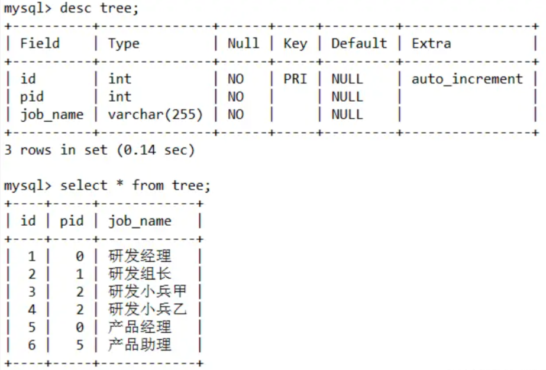

​	tree 表中通过 pid 和 id 进行父子级关联。如果现在需要按照父子级层级将 tree 表数据转换成 `一级职位 二级职位 三级职位` 三个列名进行展示，sql如下：

```sql
select t1.job_name '一级职位',
	   t2.job_name '二级职位',
	   t3.job_name '二级职位'
from tree t1 join tree t2 on t1.id = t2.pid
     left join tree t3 on t2.id = t3.pid
where t1.pid = 0;
```

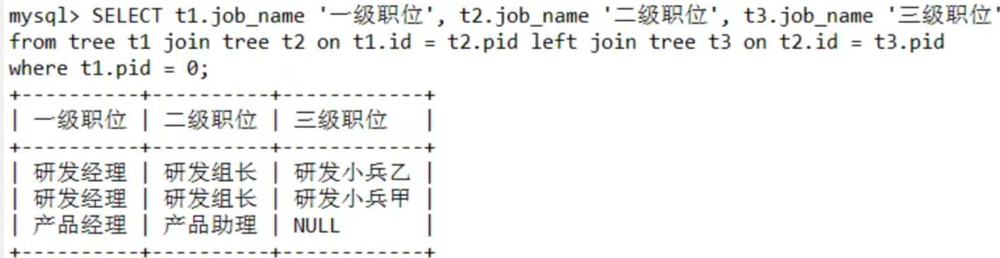

​	通过 `tree t1 join tree t2 on t1.id = t2.pid` 自连接 展示 `一级职位 二级职位`，再用 `left join tree t3 on t2.id = t3.pid` 自连接展示 `二级职位 三级职位`，最后通过 `where t1.pid = 0` 过滤非一级职位的展示。

#### 更新 emp 表和 dept 表关联数据

​	数据继续使用上面的 emp 表和 dept 表

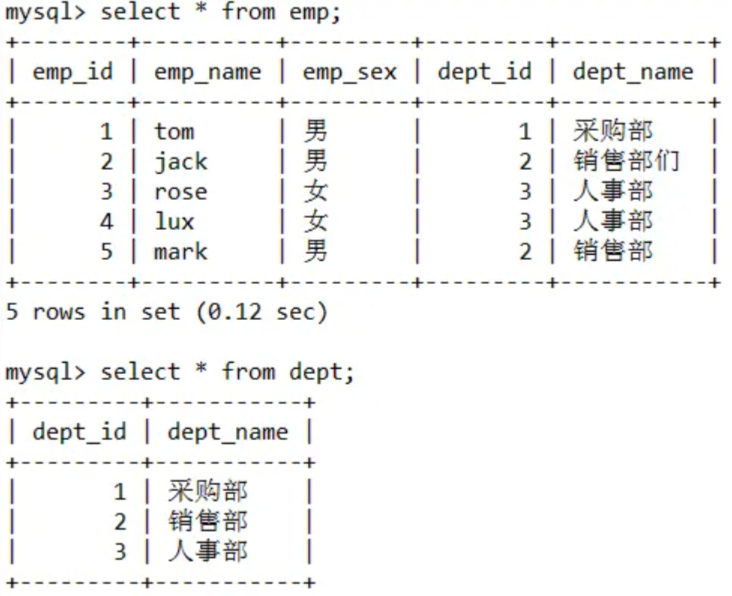

​		从表数据中可以看到 emp 表中的 jack 的部门名称和 dept 表中的部门名称不相符，现有需求需要将 jack 的部门名称更新成 dept  表中正确的名称，sql如下。

```sql
update emp, dept set emp.dept_name = dept.dept_name where emp.dept_id = dept.id;
```

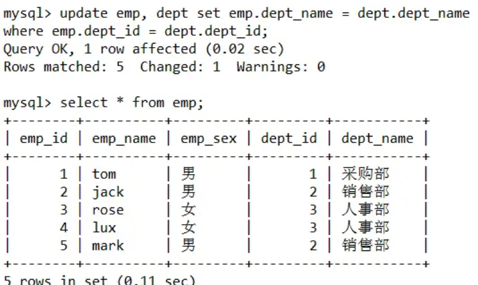

​	sql中直接关联 emp 表和 dept 表并设置关联条件，然后更新 emp 表的 dept_name 为 dept 表中的 dept_name。

#### ORDER BY - 空值 NULL 排序

​	order by 子句中可以跟要排序的字段名称，但是当字段中存在 null 值得时候，会对排序结果造成影响。我们可以通过 `order by if(isnull(title), 1, 0)` 语法将 null 值转换成0或者1，来达到将null值放到最前面还是最后面进行排序的效果。这里继续用 order_diy 表举例，sql 如下：

```sql
select * from order_diy order by if(isnull(title), 1, 0), money
```

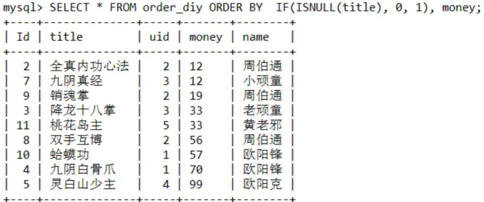

#### with rollup - 分组统计数据的基础上再进行统计汇总

​	MySQL 中使用 with rollup 再分组统计数据的基础上再进行统计汇总，即用来得到 group by 的汇总信息，这里数据继续使用 order_diy 表举例，sql如下

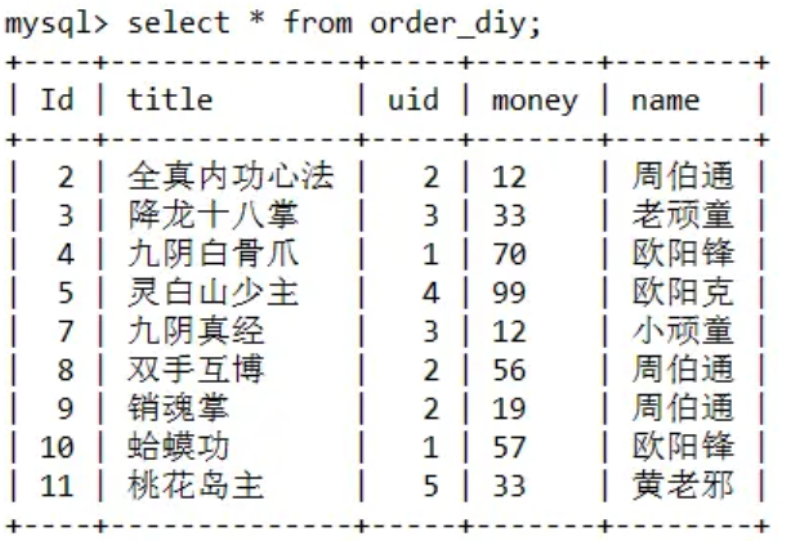

```mysql
select name, sum(money) as money
from order_diy group by name with rollup;
```

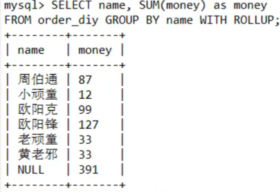

​	通过 `group by name with rollup` 语句，查询结果最后一列显示了分组统计的汇总结果。但是 name 字段汇总后显示为 null，我们可以通过 `coalesce(value…)` 比较函数，返回第一个非空参数。

```mysql
select coalesce(name, '总金额') name, sum(money) as money
from order_diy group by name with rollup;
```

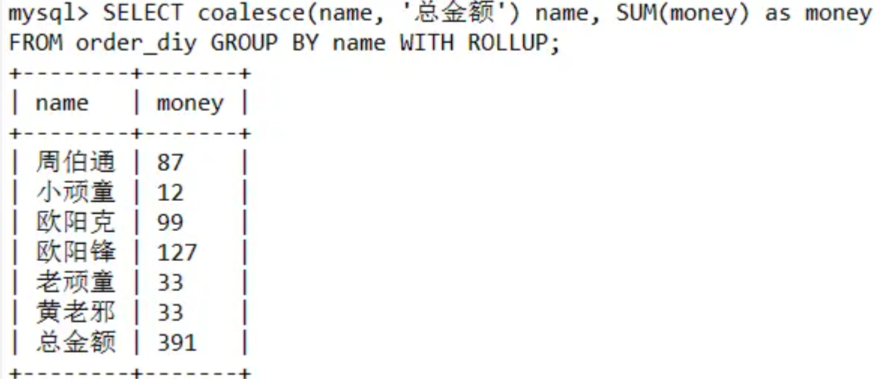

#### with as - 提取临时表别名

​	with as 语法需要 MySQL 8.0+ 以上的版本，其作用主要是提取子查询，方便后续共用，更多的使用在数据分析的场景上。

​	如果一整个查询语句中，多个子查询都需要使用同一个子查询的结果，那么就可以用 with as，将共用的子查询语句提取出来，加上别名。后续的查询语句可以直接使用，对于大量复杂的sql起到了优化作用。这里继续使用 order_diy 表进行举例，sql如下。


```mysql
with t1 as (select * from order_diy where money > 30)
     t2 as (select * from order_diy where money > 60)
select * from t1
where t1.id not in (select id from t2) and t1.name = '周伯通';
```

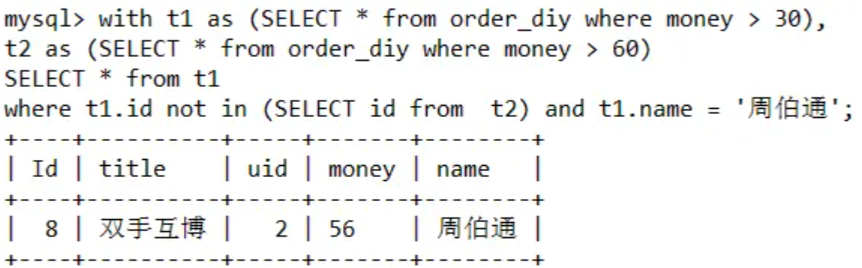

​	这个sql查询的是 order_diy 表中 money 大于 30 但是小于 60 之间并且 name 是周伯通的数据。

#### 存在就更新，不存在就插入

MySQL 中通过 `on duplicate key update` 语法来是实现存在就更新，不存在就插入的逻辑。插入或者更新时，他会根据**表中主键索引或者唯一索引进行判断**，**如果主键索引或者唯一索引有冲突**，就会执行 `on duplicate key update` 后面的复制语句。这里通过 news 表距离，结构和数据如下，news_code 字段有唯一索引：

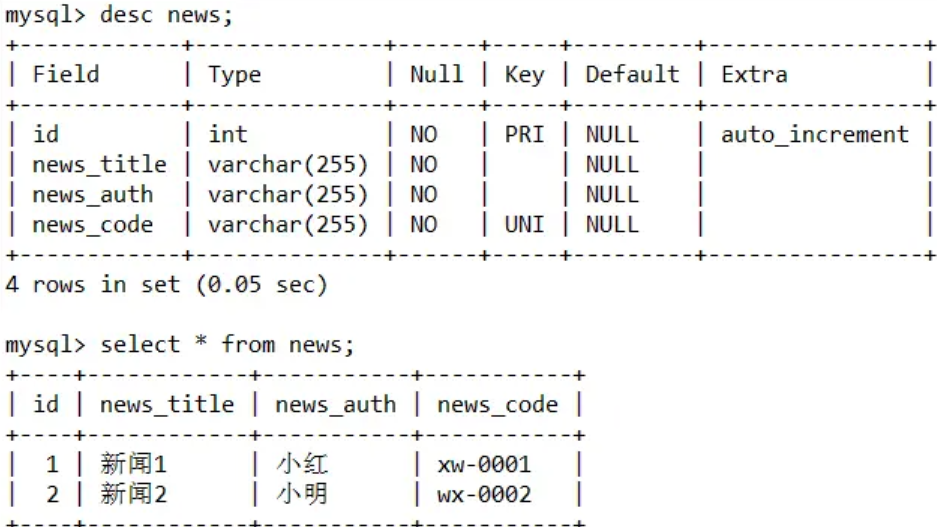

```mysql
-- 第一次执行添加语句
insert into `news` ('news_title', 'news_auth', 'news_code')
values ('新闻3', '小花', 'wx-003')
on duplicate update news_title = '新闻3'
-- 第二次执行修改语句
insert into `news` ('news_title', 'news_auth', 'news_code')
values ('新闻4', '小花', 'wx-003')
on duplicate update news_title = '新闻4'
```

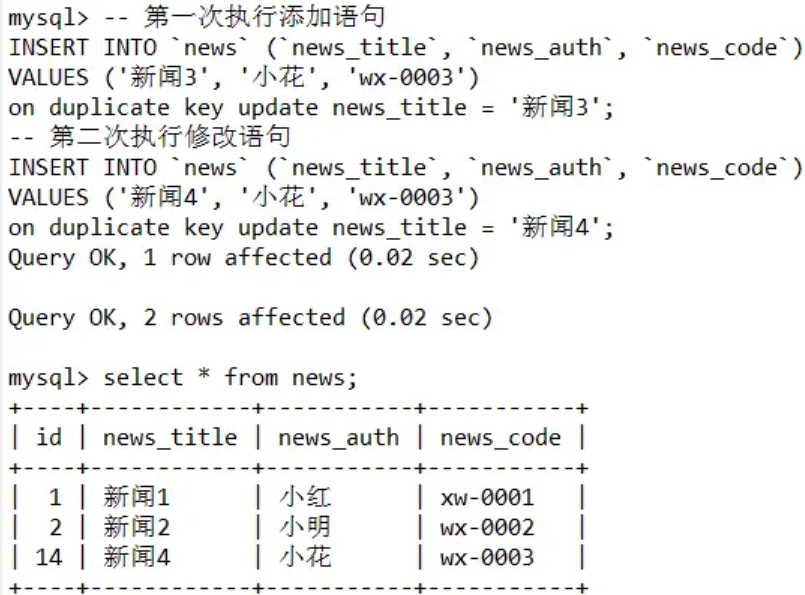


### 7、修改ORACLE单个用户密码过期策略

#### 相关链接

[修改ORACLE密码过期策略](https://blog.csdn.net/weixin_42609714/article/details/124457520)

#### 方案

```sql
-- ################ 修改单个用户密码过期策略
-- 查看profile
select profile,resource_name,limit from dba_profiles;
select * from dba_profiles where profile='PASSWORD_UNLIMIT_PROFILE';
-- 查看用户所属profile
select username,profile from dba_users;
-- 创建profile
CREATE PROFILE "PASSWORD_UNLIMIT_PROFILE" LIMIT
 COMPOSITE_LIMIT UNLIMITED
 SESSIONS_PER_USER UNLIMITED
 CPU_PER_SESSION UNLIMITED
 CPU_PER_CALL UNLIMITED
 LOGICAL_READS_PER_SESSION UNLIMITED
 LOGICAL_READS_PER_CALL UNLIMITED
 IDLE_TIME UNLIMITED
 CONNECT_TIME UNLIMITED
 PRIVATE_SGA UNLIMITED
 FAILED_LOGIN_ATTEMPTS 10
 PASSWORD_LIFE_TIME	180
 PASSWORD_REUSE_TIME UNLIMITED
 PASSWORD_REUSE_MAX	UNLIMITED
 PASSWORD_VERIFY_FUNCTION NULL
 PASSWORD_LOCK_TIME 1
 PASSWORD_GRACE_TIME 7
 INACTIVE_ACCOUNT_TIME UNLIMITED;
-- 修改profile密码过期时间
ALTER profile PASSWORD_UNLIMIT_PROFILE limit PASSWORD_LIFE_TIME UNLIMITED;
-- 修改用户所属profile
ALTER user SVC_CONFLUENCE profile PASSWORD_UNLIMIT_PROFILE;
```


### 8、MySQL免安装版初始化

#### 相关链接

[MySQL免安装版配置](https://juejin.cn/post/6854573215290359821)

[MySQL8.0.33免安装版下载地址](https://cdn.mysql.com//Downloads/MySQL-8.0/mysql-8.0.33-winx64.zip)

#### 安装流程

##### 安装目录下新建my.ini文件

- 安装目录为`mysql`文件夹的顶级目录，安装目录下不要新建`data`文件夹，后续的服务配置会生成
- 安装目录下新建`my.ini`文件，写入以下内容（记得修改其中的路径）

```ini
[client]
# 设置mysql客户端默认字符集
default-character-set=utf8
 
[mysqld]
# 设置3306端口
port = 3306
# 设置mysql的安装目录
basedir=D:\my_tool\mysql-8.0.21-winx64\mysql-8.0.21-winx64
# 设置 mysql数据库的数据的存放目录
datadir=D:\my_tool\mysql-8.0.21-winx64\mysql-8.0.21-winx64\data
# 允许最大连接数
max_connections=20
# 服务端使用的字符集默认为8比特编码的latin1字符集
character-set-server=utf8
# 创建新表时将使用的默认存储引擎
default-storage-engine=INNODB
```

##### 配置环境变量

- 配置环境变量 `path` ，将安装目录下的 `bin` 目录配置到 `path` 中。
- 即，例如 `mysql` 安装目录为 `D:\mysql` ，那么则配置成 `D:\mysql\bin`

##### 启动CMD

- 进入mysql安装目录下的bin目录

```powershell
cd D:\mysql\bin
```

- 将MySQL加入到Windows的服务中

```shell
mysqld --install
```

- 初始化数据库(初始化成功后会创建data文件夹、最后一行是生成的初始用户名和密码)

```shell
mysqld --initialize --user=root --console
```

- 启动mysql服务

```shell
net start mysql
```

- 进入MySQL修改初始密码


## 三、Linux

[VMwear安装Centos7](https://www.jianshu.com/p/ce08cdbc4ddb?utm_source=tuicool&utm_medium=referral)

### 1、Linux或Git查看二进制文件

1、vim -b (需要修改的二进制文件名称)

2、`:%!xxd`

3、输入vim的修改指令，然后修改编辑二进制文件

4、编辑完后按ESC键回到指令模式

5、`:%!xxd -r`

6、输入vim的保存指令


### 2、Linux根据日期删除文件

#### find命令参数说明

```shell
# 最后一次访问发生在 n分钟 之内
-amin -n
# 最后一次访问发生在距离当前时间 n分钟 至 (n+1)分钟
-amin n
# 最后一次访问发生在 (n+1)分钟 之外
-amin +n
# 最后一次访问发生在 n天 之内
-atime -n
# 最后一次访问发生在 n天 至 (n+1)天
-atime n
# 最后一次访问发生在 (n+1)天 之外
-atime +n
# 最后一次文件状态修改发生在 n分钟 之内
-cmin -n
# 最后一次文件状态修改发生在 n分钟 至 (n+1)分钟
-cmin n
# 最后一次文件状态修改发生在 (n+1)分钟 之外
-cmin +n
# 最后一次文件状态修改发生在 n天 之内
-ctime -n
# 最后一次文件状态修改发生在 n天 至 (n+1) 天
-ctime n
# 最后一次文件状态修改发生在 (n+1)天 之外
-ctime +n
# 最后一次文件内容修改发生在 n分钟 之内
-mmin -n
# 最后一次文件内容修改发生在 n分钟 至 (n+1)分钟
-mmin n
# 最后一次文件内容修改发生在 (n+1)分钟 之外
-mmin +n
# 最后一次文件内容修改发生在 n天 之内
-mtime -n
# 最后一次文件内容修改发生在 n天 至 (n+1)天
-mtime n
# 最后一次文件内容修改发生在 (n+1)天 之外
-mtime +n
```

**例子**

```shell
# 找到两天以外的文件
find /home/xxx/pyscripts/AutoCreate/rg_task/files/ -name "*" -mtime +2 
```

```shell
# 找到两天以外的文件并删除 利用 -exec参数，如果查找有返回，可在exec参数后加上需要操作的命令，查找结果用{}来代替
find /home/xxx/pyscripts/AutoCreate/rg_task/files/ -name "*" -mtime +2 -exec rm -rfv {} \;
```


### 3、Systemctl 常用命令

查看全部服务命令：

```sh
systemctl list-unit-files --type service
```

查看服务：

```sh
systemctl status name.service
```

增加开机启动：

```sh
systemctl enable name.service
```

启动服务：

```sh
systemctl start name.service
```

停止服务：

```sh
systemctl stop name.service
```

重启服务：

```sh
systemctl restart name.service
```

删除开机启动：

```sh
systemctl disable name.service
```


### 4、Tomcat

- 日志类
  - `nohup ./startup.sh`  用nohup启动tomcat
  - `./catalina.sh run` tomat启动后显示控制台

#### 如何访问Tomcat页面上得manager app

- 首先进入系统中tomcat所在文件夹下的`conf`中

- 编辑`tomcat-users.xml`

- 输入以下内容，编辑好后保存退出

  ```xml
   <role rolename="manager-gui"/>
   <user username="admin" password="Hyq0901." roles="manager-gui"/>
  
    <role rolename="tomcat"/>
    <user username="tomcat" password="Hyq0901." roles="tomcat"/>
  
    <role rolename="manager-script"/>
    <user username="script" password="Hyq0901." roles="manager-script"/>
  
    <role rolename="manager-jmx"/>
    <user username="jmx" password="Hyq0901." roles="manager-jmx"/>
  
    <role rolename="manager-status"/>
    <user username="status" password="Hyq0901." roles="manager-status"/>
  
    <role rolename="admin-gui"/>
    <user username="adminGui" password="Hyq0901." roles="admin-gui"/>
  ```

- 再进入`webapps/manager/META-INF/`下编辑文件`context.xml`，将以下内容注释

  ```xml
  <Valve className="org.apache.catalina.valves.RemoteAddrValve"
           allow="127\.\d+\.\d+\.\d+|::1|0:0:0:0:0:0:0:1" />
  ```

- 重启tomcat

#### 修改Tomcat项目访问路径名

- 进入tomcat所在文件夹下得conf文件夹中

- 修改`server.xml`文件，再文件底部输入以下内容

  ```XML
  <Context path="/store" docBase="store-0.0.1/" reloadble="true"/>
  ```

  - `path`代表用浏览器访问的时候的的路径，如http://localhost:8080/web来访问path=”/web”
  - `docBase`为你的项目的路径，这里同样既可以用相对路径，也可以用绝对路径。设置好了之后就会把项目自动映射到ROOT
  - `reloadable`，如果这个属性设为true，tomcat服务器在运行状态下会监视在WEB-INF/classes和WEB-INF/lib目录下class文件的改动，如果监测到有class文件被更新的，服务器会自动重新加载Web应用

- 保存退出并重启tomcat


### 5、Docker 设置elasticsearch密码

| 序号 | 账号                   | 密码     |
| ---- | ---------------------- | -------- |
| 1    | elastic                | Hyq0901. |
| 2    | apm_system             |          |
| 3    | kibana_system          |          |
| 4    | logstash_system        |          |
| 5    | beats_system           |          |
| 6    | remote_monitoring_user |          |

- 在 `elasticsearch.yml` 中添加一下代码

```yaml
xpack.security.enabled: true
xpack.license.self_generated.type: basic
xpack.security.transport.ssl.enabled: true
```

- 在进入docker中的elasticsearch下的bin目录

```shell
docker exec -it elasticsearch /bin/bash
cd bin
```

- 输入以下内容

```shell
elasticsearch-setup-passwords interactive
```


### 6、设置命令全局的别名

#### 全局(所有用户所有终端)

```shell
# 打开系统文件
vim /etc/bashrc
# 将光标移动到文件最后一行后面，按下小o
# 粘贴或输入赋予别名的命令 
# alias [别名]='原命令'
alias grep='grep --color=auto'
# 保存文件并退出
# 重载文件
source /etc/bashrc
```

#### 局部(针对某个用户)

```shell
# 打开系统文件
vim ~/.bashrc
# 将光标移动到文件最后一行后面，按下小o
# 粘贴或输入赋予别名的命令 
# alias [别名]='原命令'
alias grep='grep --color=auto'
# 保存文件并退出
# 重载文件
source ~/.bashrc
```

#### 临时(当前终端当前用户)

```shell
# alias [别名]='原命令'
alias grep='grep --color=auto'
```


### 7、Linux设置类似$HOME的目录的快捷目录

- 第一步打开 `/etc/default/useradd` 这个文件
- 然后在最后一行写下 `名字=/目录`
- 按下ESC输入`:wq`保存并退出
- 最后输入 `source /etc/default/useradd` 或者 `source useradd`


### 8、Linux防火墙以及开放端口管理

```shell
# 查看防火墙是否开启
systemctl status firewalld
# 若没有开启则是开启状态,关闭则是 stop
systemctl start firewalld
# 查看所有开启的端口
firewall-cmd --list-ports

# 防火墙开启端口访问
# --zone 作用域 --add-port=80/tcp 添加端口 端口/通讯协议 --permanent  永久生效
firewall-cmd --zone=public --add-port=80/tcp --permanent
#关闭端口
firewall-cmd --zone=public --remove-port=5672/tcp --permanent

# 重启防火墙
firewall-cmd --reload
# 查看防火墙状态 是否是running
firewall-cmd --state
# 列出支持的zone
firewall-cmd --get-zones
# 列出支持的服务 服务是放行的
firewall-cmd --get-services
# 查看ftp服务是否支持，返回yes or no
firewall-cmd --query-service ftp
#永久移除ftp服务
firewall-cmd --remove-service=ftp --permanent
# 查看以开放的端口
firewall-cmd --zone=public --list-ports
# 查看监听端口
netstat -Inpt
# 检查端口被那个进程占用
netstat -Inpt |grep 5672
#查看进程的详细信息
ps 6832
# 终止进程
kill -9 6832
```


### 9、Iptables防火墙

#### Iptables防火墙介绍

- Linux系统内核集成了网络访问控制的功能，通过netfilter模块来实现，是内核的一部分（内核空间）
- 用户层（用户空间）可以通过iptables程序对netfilter进行控制管理，进而实现网络的访问控制
- TCP_Wrappers 也是一个网络访问控制的一个工具，作用在应用层（7层防火墙）

总结

- netfilter模块		内核空间，是内核一部分 
- iptables组件  用户空间，提供管理防火墙的手段，它主要作用在传输层（4层防火墙）

#### Iptables基本语法

- iptables [-t 表名] 命令选项 ［链名］ [规则号码] ［条件匹配］ ［-j 目标动作]

- 如果不指定表名，默认操作filter表

- 说明：
  表名和链名：用于指定 iptables命令所操作的表和链；
              命令选项：用于指定管理iptables规则的方式（比如：插入、增加、删除、查看等）；
  规则号吗：用于指定规则的编号；
  条件匹配：用于指定对符合什么样条件的数据包进行处理（比如：什么协议、出入网卡等）；
  目标动作：用于指定数据包的处理方式（比如：允许通过、拒绝、丢弃等）

- 示例

  ```shell
  iptables -L
  iptables -t filter -L
  iptables -t nat -L
  iptables -t raw -L
  iptables -t mangle -L
  ```

- 启停命令

  ```shell
  # 临时停止|启动|查看状态|重新加载|重新启动
  service iptables stop|start|status|reload|restart	
  # 开机是否自启动
  chkconfig iptables off|on
  # 永久保存规则
  vim	/etc/sysconfig/iptables
  ```

- 常用命令

  ```shell
  常见的命令选项：
  -L								查看
  -A								追加，放置最后一条
  -I								插入，默认插入成第一条
  -D								删除
  -F								清空flush
  -P     						    设置默认策略policy
  
  处理动作：
  filter表:
  -j ACCEPT				允许
  -j DROP					丢弃，没有任何提示信息
  -j REJECT				拒绝，有提示信息
  -j LOG					写日志     /var/log/messages    然后将数据包传递给下一条规则
  
  nat表:
  -j SNAT						源地址转换 POSTROUTING
  -j DNAT						目标地址转换 PREROUTING
  ```


#### Filter表

示例：

- 全部允许/拒绝/丢弃

```shell
# 添加规则，丢弃所有进来的数据包
iptables -t filter -A INPUT -j DROP
# 添加规则，允许所有进来的数据包
iptables -t filter -A INPUT -j ACCEPT

# 指定位置插入规则，允许所有进来的数据包第1条规则
iptables -t filter -I INPUT 1 -j ACCEPT
# 添加规则，丢弃所有出去的数据包
iptables -t filter -A OUTPUT -j DROP

# 指定位置插入规则，拒绝所有进来的数据包为第3条规则
iptables -t filter -I INPUT 3 -j REJECT	  
# 查看规则编号
iptables -t filter -L --line-numbers
# 覆盖已有规则
iptables -t filter -R INPUT 1 -j ACCEPT
# 删除INPUT链的第3条规则
iptables -t filter -D INPUT 3
# 清空filter表的所有规则
iptables -t filter -F
# 增加规则，先写日志，然后将数据包传递给下一条规则
iptables -A INPUT -j LOG
iptables -I INPUT 2 -j DROP
# 设置链上的默认规则
iptables -t filter -P INPUT DROP
iptables -D INPUT 1
```

- 根据源和目标地址匹配

```shell
# 匹配条件
# -s 192.168.1.1/24	源地址
# -d 192.168.1.2		目标地址
# -p tcp|upd|icmp		协议
# -i lo				input从lo接口进入得数据包
# -o eth0				output从eth0出去的数据包
# -p tcp --dport 80 	目标端口是80，需和-p tcp|upd|icmp连用
# -p udp --dport 53	目标端口是53，协议是udp
  
# 允许源地址为10.1.1.3进入
iptables -t filter -A INPUT -s 10.1.1.3 -j ACCEPT
# 不允许源地址为10.1.1.3进入
iptables -t filter -A INPUT ! -s 10.1.1.3 -j ACCEPT
# 拒绝源地址为10.1.1.3进入
iptables -t filter -A INPUT -s 10.1.1.3 -j DROP
# 丢弃到达目标地址为10.1.1.3的包
iptables -t filter -A OUTPUT -d 10.1.1.3 -j DROP
# 丢弃到达目标地址为10.1.1.3的包
iptables -t filter -A OUTPUT ! -d 10.1.1.3 -j ACCEPT
# 丢弃所有到目标地址10.1.1.2的包	
iptables -t filter -A INPUT -d 10.1.1.2 -j DROP
# 源地址为10.1.1.2出去的包全部允许
iptables -t filter -A OUTPUT -s 10.1.1.2 -j ACCEPT
```

  

### 10、Vim 的使用


#### VIM 中的替换操作

##### 语法：

- `[range]s/目标字符串/替换字符串/[option]`
- s是substitute的简写，代表执行替换字符操作

###### [range]

- range 的值表示搜索范围，默认表示当前行
- range的值如果为`1,10`表示从第一行到第10行
- %表示整个文件,也可以写成`1,$`
- $表示从当前行到本文件末尾

###### [option]

表示操作类型，默认只对第一个匹配的字符串进行替换

- option字段值g(global)表示全局替换
- c(comfirm)表示操作时需要确认
- i(ignorecase)表示不区分大小写

##### 例子：

- `$s/Vim/vim/gc` 会出现提示`replace with foo(y/n/a/q/l/^E/^Y)?`，询问是否确认执行
  - 待选择操作的含义包括：
  - y:确认执行这个替换将将所有Vim替换成vim;
  - n:取消这个本交Vim替换命令的操作;
  - a:执行本次所有替换字符串操作且不再询问;
  - q:退出当前vim字符串替换操作而不做任何改动;
  - l:替换完当前匹配点后退出(last)
  - Ctrl + E:向上翻滚一行
  - Ctrl + Y:向下翻滚一行


### 11、在Windows环境下安装docker

1. 首先进入[官网](https://docs.docker.com/desktop/install/windows-install/)下载安装包
2. 然后不要直接安装下载的安装包，需要根据文档提示下载并启用WSL服务
3. 进入Microsoft的[WSL安装教程网](https://docs.microsoft.com/zh-cn/windows/wsl/install-manual#step-4---download-the-linux-kernel-update-package)，根据文档提示安装
4. 最后安装第一步下载的安装包


### 12、Oracle Database Docker 镜像制作

#### 相关网址

[oracle/dockerimages](https://github.com/oracle/docker-images)

##### 下载

1. 首先先前往[官网下载](https://github.com/oracle/docker-images)docker-images

##### 上传

1. 将下载的docker-images中的OracleDatabase目录上传至linux上
   1. OracleDatabase目录下的RAC应该是集群
   2. SingleInstance是单节点
   3. 根据需求进入对应目录中的dockerfiles目录下

##### 讲解

1. dockerfiles目录下包含了`11.2.0.2、``12.1.0.2、``12.2.0.1、``18.3.0、``18.4.0、``19.3.0、``21.3.0` 七个Oracle版本的文件夹
2. `buildContainerImage.sh` 用于构建镜像的脚本
3. 执行 `.buildContainerImage.sh -h` 可以看到他的帮助文档，或者前往[官网](https://github.com/oracle/docker-images/tree/main/OracleDatabase/SingleInstance)
4. 每个目录对应不通的版本，将你从官网下载的oracle版本放入到对应的目录，然后按照buildContainerImage.sh脚本的帮助文档 执行对应的命令和添加对应的参数

```
Usage: buildContainerImage.sh -v [version] -t [image_name:tag] [-e | -s | -x] [-i] [-o] [container build option]
Builds a container image for Oracle Database.

Parameters:
   -v: version to build
       Choose one of: 11.2.0.2  12.1.0.2  12.2.0.1  18.3.0  18.4.0  19.3.0  21.3.0

   -t: image_name:tag for the generated docker image
   -e: creates image based on 'Enterprise Edition'
   -s: creates image based on 'Standard Edition 2'
   -x: creates image based on 'Express Edition'
   -i: ignores the MD5 checksums
   -o: passes on container build option

* select one edition only: -e, -s, or -x

LICENSE UPL 1.0

Copyright (c) 2014,2021 Oracle and/or its affiliates.
```

##### 躲坑


1. 第一个红圈说明了在执行 `buildContainerImage.sh` 脚本来构建每个版本的镜像时跟的参数，比如11g是-x，12c可以是-e也可以是-s

2. 第二个红圈要特别注意，需要将下载下来额Oracle包的名字改成 `linuxx64__database.zip` 这种格式，19c不需要，直接在官网下载 `Linux x86-64` 这个版本就ok，但是12c和11g不一样，如果遇到下载下来的包名字不对或者在执行脚本时报错找不到包，则需要仔细核查包名字然后修改

3. 其中 18c XE 和 21c XE 的不用下载镜像，其余版本都需要自行下载镜像

4. 11g的版本不能用 `linuxx64__database.zip` 这种格式的包，而是需要 `oracle-xe-11.2.0-1.0.x86_64.rpm.zip` 这个格式的包。

5. 每个包都需要放到对应版本的目录下

6. 以上关于 `包名字` 相关的都可以进入 `每个版本文件夹` 下，然后去查看其中的 `DockerFile` 文件

   

##### 提醒

1. oracle11g 需要的是 oracle-xe-11.2.0-1.0.x86_64.rpm.zip 这个安装包。

2. 在镜像制作完成后 docker run的时候 要加上 --shm-size="2g" 来设置容日的内存，如果不设置可能会导致容器启动失败

3. sqlplus 出现 `ORA-12547: TNS:lost contact`

   `执行 chmod 6751 $ORACLE_HOME/bin/*`


### 13、Docker部署Oracle19c

#### 相关链接

[Oracle Database Docker 镜像制作](https://confluence.kevinkda.cn:2100/pages/viewpage.action?pageId=1900685)

[docker-compose](https://github.com/oracle/docker-images/tree/main/OracleDatabase/SingleInstance)

#### 构建工具

docker-compose

#### 构建步骤

##### 1、拉取镜像

```shell
执行命令：docker pull registry.cn-beijing.aliyuncs.com/kevinkda/env:oracle-19c-ee
```

##### 2、创建Copy镜像

```shell
docker run -d -p 1522:1522 --name oracle registry.cn-beijing.aliyuncs.com/kevinkda/env:oracle-18.4x
```

##### 3、复制Copy镜像中的文件到本地并赋权

```shell
# 复制Copy镜像中的文件到本地
docker cp oracle:/opt/oracle/oradata /mnt/remote/data/db/oracle/oracle_env_01/oradata
docker cp oracle:/opt/oracle/scripts/startup /mnt/remote/data/db/oracle/oracle_env_01/scripts/
docker cp oracle:/opt/oracle/scripts/setup /mnt/remote/data/db/oracle/oracle_env_01/scripts
# 赋权
chmod 777 oradata/ scripts/
```

##### 4、使用docker-compose启动镜像

```
version: '3.9'
services:
  oracle_env_01:
    container_name: oracle_env_01
    image: registry.cn-beijing.aliyuncs.com/kevinkda/env:oracle-19c-ee
    # restart: none
    restart: always
    privileged: true
    hostname: oracle_18x
    network_mode: bridge
    # command: sleep 36000
    # network_mode: host
    # env_file:
    #   - /mnt/remote/docker_compose/env/wiki.js.mysql.env
    environment:
      TZ: 'Asia/Shanghai'
      # ORACLE_SID: ORCLCDB
      # ORACLE_PDB: ORCLPDB1
      ORACLE_PWD: avKtYefWD@X6H3tg
    ports:
      - 1521:1521
      - 5502:5500
    volumes:
      - /etc/localtime:/etc/localtime
      # - /mnt/remote/data/db/oracle/oracle_env_01/oracle:/opt/oracle
      # - /mnt/remote/data/db/oracle/oracle_env_01/init:/docker-entrypoint-initdb.d
      - /mnt/remote/data/db/oracle/oracle_env_01/oradata:/opt/oracle/oradata
      - /mnt/remote/data/db/oracle/oracle_env_01/scripts/startup:/opt/oracle/scripts/startup
      - /mnt/remote/data/db/oracle/oracle_env_01/scripts/setup:/opt/oracle/scripts/setup
    deploy:
      resources:
        limits:
          cpus: '30.0'
          memory: 2g 
    ulimits:
      memlock:
        soft: -1
        hard: -1
      nofile:
        soft: 65536
        hard: 65536
```

##### 5、查看启动日志

执行命令：**docker logs -f oracle**

##### 6、oracle初始化

**连接oracle，执行命令：**docker exec -it oracle /bin/bash**
连接sysdba，执行命令：**sqlplus / as sysdba**
显示初始化的数据库，执行命令：**show pdbs**
修改 system 的密码，执行命令：**alter user system identified by system;**
修改 sys 的密码，执行命令：**alter user sys identified by sys;**
设置修改的密码永不过期，执行命令：**alter profile default limit password_life_time unlimited;**

##### 额外知识

如果需要解锁某个用户并用该用户的数据库

给某用户授予管理员权限，执行命令：**grant dba to 用户;**
更改密码，执行命令：**alter user 用户 identified by 密码;**
设置密码永不过期，执行命令：**alter profile default limit password_life_time unlimited;**
解锁用户，执行命令：**alter user 用户 account unlock**


### 14、Linux下创建swap文件

1. 创建一个足够大的文件

   `dd if=/dev/sdb1 of=/www/swapfile bs=1024 count=4096000`

   (count的值等于1024 x 你想要的文件大小, 4096000是4G)

2. 把这个文件变成swap文件.

   `mkswap /www/swapfile`

3. 启用这个swap文件

   `swapon /www/swapfile`

4. 在每次开机的时候自动加载swap文件, 需要在 /etc/fstab 文件中增加一行

   `/www/swapfile swap swap defaults 0 0`

5. 查看swap

   `cat /proc/swaps`


### 15、docker设置镜像加速器

```shell
#修改/etc/docker/daemon.json文件
vi /etc/docker/daemon.json
#输入以下内容
{
  "registry-mirrors": [
    "https://emt7vast.mirror.aliyuncs.com",
    "https://docker.mirrors.ustc.edu.cn/",
    "https://hub-mirror.c.163.com/"
  ]
}
```


### 16、Linux安装docker-compose

​	[官网地址](https://docs.docker.com/compose/install/)

1. 安装docker-compose之前，服务器上必须安装好docker。

2. docker-compose安装步骤

   ```shell
   # 国内加速安装
   curl -L https://get.daocloud.io/docker/compose/releases/download/v1.24.1/docker-compose-`uname -s`-`uname -m` > /usr/local/bin/docker-compose
   # 对二进制文件应用可执行权限
   sudo chmod +x /usr/local/bin/docker-compose
   # 测试安装结果
   docker-compose --version
   ```

3. 安装结果截图


### 17、Linux环境下网络测速的方法

1. #### 下载安装包进行测试

   1. 使用wget命令下载一个安装包(例如npm包)

      ```shell
      wget http://soft.vpser.net/lnmp/lnmp1.7-full.tar.gz
      ```

      

2. #### 安装Speedtest进行测试

   Speedtest 是一个用 Python 编写的轻量级 Linux 命令行工具，可基于 Speedtest.net 的基础架构来测量linux服务器网络的上/下行速率！

   1. 安装

      ```shell
      wget https://raw.github.com/sivel/speedtest-cli/master/speedtest.py
      chmod a+rx speedtest.py
      mv speedtest.py /usr/local/bin/speedtest
      chown root:root /usr/local/bin/speedtest
      ```

   2. 运行检测

      1. speedtest

      ```shell
      speedtest
      ```

      

      2. speedtest --share

      ```shell
      speedtest --share
      ```

      
      
      打开 speedtest 测试结果的连接，可以显示测试结果的图示
      
      


### 18、Linux下使用curl发送get/post请求

curl是一个非常实用的、用来与服务器之间传输数据的工具；支持的协议包括 (DICT, FILE, FTP, FTPS, GOPHER, HTTP, HTTPS, IMAP, IMAPS, LDAP, LDAPS, POP3, POP3S, RTMP, RTSP, SCP, SFTP, SMTP, SMTPS, TELNET and TFTP)，curl设计为无用户交互下完成工作；curl提供了一大堆非常有用的功能，包括代理访问、用户认证、ftp上传下载、HTTP POST、SSL连接、cookie支持、断点续传。

- 发送get请求

```shell
# 不带参数
curl ${url}
# 带参数
curl ${url}?a=1&b=2
```

- 发送post请求

```shell
# 普通请求
curl -X POST -d 'a=1&b=2' ${url}
# 发送json格式请求
curl -H "Content-Type: application/json" -X POST -d '{"abc":123,"bcd":"nihao"}' URL
curl -H "Content-Type: application/json" -X POST -d @test.json URL
```

其中，-H代表header头，-X是指定什么类型请求(POST/GET/HEAD/DELETE/PUT/PATCH)，-d代表传输什么数据。这几个是最常用的。

- 查看所有curl命令： `man curl或者curl -h`
- 请求头：`H,A,e`
- 响应头：`I,i,D`
- cookie：`b,c,j`
- 传输：`F(POST),G(GET),T(PUT),X`
- 输出：`o,O,w`
- 断点续传：`r`
- 调试：`v,--trace,--trace-ascii,--trace-time`


### 19、Redis

- Redis支持五种数据类型：string（字符串），hash（哈希），list（列表），set（集合）及zset(sorted set：有序集合)。

#### Redis 常用命令集

##### 系统相关

```shell
# 将数据同步保存到磁盘
save
# 将数据异步保存到磁盘
bgsave
# 返回上次成功将数据保存到磁盘的Unix时戳
lastsave
# 将数据同步保存到磁盘，然后关闭服务
shundown
############### 远程服务控制
# 提供服务器的信息和统计
info
# 实时转储收到的请求
monitor
# 改变复制策略设置
slaveof
# 在运行时配置Redis服务器
config
############### 安全相关
# 查看是否设置了密码
CONFIG get requirepass
# 设置密码
CONFIG set requirepass "***"
# 查看密码
CONFIG get requirepass
# 验证密码
AUTH ***
```

##### 数据库相关

```shell
# 选择数据库
select 1
# 查看所有keys
keys *
# 查看前缀为"prefix_"的所有keys
keys prefix_*
# 清除当前数据库的所有keys
flushdb
# 清除所有数据库的所有keys
flushall
# 移动当前数据库中的key到dbindex数据库
move(key, dbindex)
# 返回当前数据库中key的数目
dbsize
```

##### 订阅命令

```shell
# 订阅一个或多个符合给定模式的频道
PSUBSCRIBE pattern [pattern ...]
# 查看订阅与发布系统状态。
PUBSUB subcommand [argument [argument ...]]
# 将信息发送到指定的频道。
PUBLISH channel message
# 退订所有给定模式的频道。
PUNSUBSCRIBE [pattern [pattern ...]]
# 订阅给定的一个或多个频道的信息。
SUBSCRIBE channel [channel ...]
# 指退订给定的频道。
UNSUBSCRIBE [channel [channel ...]]
```

##### 事务命令

```shell
# 取消事务，放弃执行事务块内的所有命令。
DISCARD
# 执行所有事务块内的命令。
EXEC
# 标记一个事务块的开始。
MULTI
# 取消 WATCH 命令对所有 key 的监视。
UNWATCH
# 监视一个(或多个) key ，如果在事务执行之前这个(或这些) key 被其他命令所改动，那么事务将被打断。
WATCH key [key ...]
```

##### 脚本命令

```shell
# 执行Lua脚本
EVAL script numkeys key [key ] arg [arg ]
# 执行Lua脚本
EVALSHA sha1 numkeys key [key ...\] arg [arg ...]
# 查看指定脚本
SCRIPT EXISTS script [script ...]
# 从脚本缓存中一处所有脚本
SCRIPT FLUSH
# 杀死所有脚本
SCRIPT KILL
# 将脚本添加到脚本缓存中，但不执行
SCRIPT LOAD script
```

##### Redis GEO

- Redis GEO 主要用于存储地理位置信息，并对存储的信息进行操作，该功能在 Redis 3.2 版本新增。

```shell
# 添加地理位置的坐标。
geoadd
# 获取地理位置的坐标。
geopos
# 计算两个位置之间的距离。
geodist
# 根据用户给定的经纬度坐标来获取指定范围内的地理位置集合。
georadius
# 根据储存在位置集合里面的某个地点获取指定范围内的地理位置集合。
georadiusbymember
# 返回一个或多个位置对象的 geohash 值。
geohash
```

##### 对key和value的操作

```shell
# 确认一个key是否存在
exists(key)
# 删除一个key
del(key)
# 返回值的类型
type(key)
# 返回满足给定pattern的所有key
keys(pattern)
# 随机返回key空间的一个
randomkey
# 重命名key
keyrename(oldname, newname)
# 设定一个key的活动时间（s）
expire
# 获得一个key的活动时间
ttl
# 按索引查询
select(index)
```

##### String

- String 是 redis 最基本的类型，一个 key 对应一个 value。
- 一个键最大能存储 512MB。

```shell
# 给数据库中名称为key的string赋予值value
set(key, value)
# 返回数据库中名称为key的string的value
get(key)
# 给名称为key的string赋予上一次的value
getset(key, value)
# 返回库中多个string的value
mget(key1, key2,…, key N)
# 添加string，名称为key，值为value
setnx(key, value)
# 向库中添加string，设定过期时间time
setex(key, time, value)
# 批量设置多个string的值
mset(key N, value N)
# 如果所有名称为key i的string都不存在
msetnx(key N, value N)
# 名称为key的string增1操作
incr(key)
# 名称为key的string增加integer
incrby(key, integer)
# 名称为key的string减1操作
decr(key)
# 名称为key的string减少integer
decrby(key, integer)
# 名称为key的string的值附加value
append(key, value)
# 返回名称为key的string的value的子串
substr(key, start, end)
```

##### Hash

- Redis hash 是一个键值(key=>value)对集合。
- Redis hash 是一个 string 类型的 field 和 value 的映射表，hash 特别适合用于存储对象。
- 每个 hash 可以存储 232 -1 键值对（40多亿）。

```shell
# 向名称为key的hash中添加元素field
hset(key, field, value)
# 返回名称为key的hash中field对应的value
hget(key, field)
# 返回名称为key的hash中field i对应的value
hmget(key, (fields))
# 向名称为key的hash中添加元素field 
hmset(key, (fields))
# 将名称为key的hash中field的value增加integer
hincrby(key, field, integer)
# 名称为key的hash中是否存在键为field的域
hexists(key, field)
# 删除名称为key的hash中键为field的域
hdel(key, field)
# 返回名称为key的hash中元素个数
hlen(key)
# 返回名称为key的hash中所有键
hkeys(key)
# 返回名称为key的hash中所有键对应的value
hvals(key)
# 返回名称为key的hash中所有的键（field）及其对应的value
hgetall(key)
```

##### List 

- Redis 列表是简单的字符串列表，按照插入顺序排序。你可以添加一个元素到列表的头部（左边）或者尾部（右边）。
- 列表最多可存储 232 - 1 元素 (4294967295, 每个列表可存储40多亿)。

```shell
# 在名称为key的list尾添加一个值为value的元素
rpush(key, value)
# 在名称为key的list头添加一个值为value的 元素
lpush(key, value)
# 返回名称为key的list的长度
llen(key)
# 返回名称为key的list中start至end之间的元素
lrange(key, start, end)
# 截取名称为key的list
ltrim(key, start, end)
# 返回名称为key的list中index位置的元素
lindex(key, index)
# 给名称为key的list中index位置的元素赋值
lset(key, index, value)
# 删除count个key的list中值为value的元素
lrem(key, count, value)
# 返回并删除名称为key的list中的首元素
lpop(key)
# 返回并删除名称为key的list中的尾元素
rpop(key)
# lpop命令的block版本
blpop(key1, key2,… key N, timeout)
# rpop的block版本
brpop(key1, key2,… key N, timeout)
# 返回并删除名称为srckey的list的尾元素，并将该元素添加到名称为dstkey的list的头部
rpoplpush(srckey, dstkey)
```

##### Set

- Redis 的 Set 是 string 类型的无序集合。
- 集合是通过哈希表实现的，所以添加，删除，查找的复杂度都是 O(1)。
- 若sadd了一个数据两次，根据集合内元素的唯一性，第二次插入的元素将被忽略
- sadd命令
  - 添加一个 string 元素到 key 对应的 set 集合中，成功返回 1，如果元素已经在集合中返回 0。
  - sadd key member

```shell
# 向名称为key的set中添加元素member
sadd(key, member)
# 删除名称为key的set中的元素member
srem(key, member)
# 随机返回并删除名称为key的set中一个元素
spop(key)
# 移到集合元素
smove(srckey, dstkey, member)
# 返回名称为key的set的基数
scard(key)
# member是否是名称为key的set的元素
sismember(key, member)
# 求交集
sinter(key1, key2,…key N)
# 求交集并将交集保存到dstkey的集合
sinterstore(dstkey, (keys))
# 求并集
sunion(key1, (keys))
# 求并集并将并集保存到dstkey的集合
sunionstore(dstkey, (keys))
# 求差集
sdiff(key1, (keys))
# 求差集并将差集保存到dstkey的集合
sdiffstore(dstkey, (keys))
# 返回名称为key的set的所有元素
smembers(key)
# 随机返回名称为key的set的一个元素
srandmember(key)
```

##### Zset

- Redis zset 和 set 一样也是string类型元素的集合,且不允许重复的成员。

- 不同的是每个元素都会关联一个double类型的分数。
- Redis正是通过分数来为集合中的成员进行从小到大的排序。

- zset的成员是唯一的,但分数(score)却可以重复。
- zrange根据索引序列查询，zrangebyscore根据score值查询。

- zadd命令
  - 添加元素到集合，元素在集合中存在则更新对应score
  - zadd key score member 


#### Redis 性能测试

##### 语法

redis 性能测试的基本命令如下：

```
redis-benchmark [option] [option value]
```

##### redis 性能测试工具参数

| 序号 | 选项               | 描述                                       | 默认值    |
| :--- | :----------------- | :----------------------------------------- | :-------- |
| 1    | -h                 | 指定服务器主机名                           | 127.0.0.1 |
| 2    | -p                 | 指定服务器端口                             | 6379      |
| 3    | -s                 | 指定服务器 socket                          |           |
| 4    | -c                 | 指定并发连接数                             | 50        |
| 5    | -n                 | 指定请求数                                 | 10000     |
| 6    | -d                 | 以字节的形式指定 SET/GET 值的数据大小      | 2         |
| 7    | -k                 | 1=keep alive 0=reconnect                   | 1         |
| 8    | -r                 | SET/GET/INCR 使用随机 key, SADD 使用随机值 |           |
| 9    | -P                 | 通过管道传输 <numreq> 请求                 | 1         |
| 10   | -q                 | 强制退出 redis。仅显示 query/sec 值        |           |
| 11   | --csv              | 以 CSV 格式输出                            |           |
| 12   | -l（L 的小写字母） | 生成循环，永久执行测试                     |           |
| 13   | -t                 | 仅运行以逗号分隔的测试命令列表。           |           |
| 14   | -I（i 的大写字母） | Idle 模式。仅打开 N 个 idle 连接并等待。   |           |


### 20、Linux日志审计

#### 相关连接

[Linux日志审计系统命令](https://javaforall.cn/230931.html)

[Linux系统加固](https://blog.csdn.net/qq_37561898/article/details/125359226)

#### Linux中常见日志以及位置

| 位置              | 名称                          |
| ----------------- | ----------------------------- |
| /var/log/cron     | 记录了系统定时任务相关的日志  |
| /var/log/auth.log | 记录验证和授权方面的信息      |
| /var/log/secure   | 同上，区别是系统不同          |
| /var/log/btmp     | 登录失败记录，使用lastb查看   |
| /var/log/wtmp     | 登录成功记录，使用last查看    |
| /var/log/lastlog  | 最后一次登录，使用lastlog查看 |
| /var/run/utmp     | 使用w、who、users命令查看     |

​	/var/log/auth.log、/var/log/secure记录验证和授权方面的信息，只要涉及账号和密码的程序都会记录，比如SSH登录，su切换用户，sudo授权，甚至添加用户和修改用户密码都会记录在这个日志文件中

#### 常用审计命令

```shell
# 定位多少IP在爆破root账号
grep "Failed password for root" /var/log/secure | awk '{print $11}' | sort | uniq -c | sort -nr | more  

# 定位有多少IP在爆破
grep "Failed password" /var/log/secure|grep -E -o "(25[0-5]|2[0-4][0-9]|[01]?[0-9][0-9]?)\.(25[0-5]|2[0-4][0-9]|[01]?[0-9][0-9]?)\.(25[0-5]|2[0-4][0-9]|[01]?[0-9][0-9]?)\.(25[0-5]|2[0-4][0-9]|[01]?[0-9][0-9]?)"|uniq -c

# 爆破用户名的字典是什么
grep "Failed password" /var/log/secure|perl -e 'while($_=<>){ /for(.*?) from/; print "$1\n";}'|uniq -c|sort -nr

# 查看登录成功的IP有哪些
grep "Accepted " /var/log/secure | awk '{print $11}' | sort | uniq -c | sort -nr | more

# 登录成功的日志、用户名、IP
grep "Accepted " /var/log/secure | awk '{print $1,$2,$3,$9,$11}' 
```


### 21、chmod命令详解

#### 简介

​	chmod命令主要用于修改、设置文件权限，chmod修改文件权限主要用两种方式：字母法和数字法

#### 字母法

##### 语法

```shell
# (u g o a)
# u user 表示该文件所有者
# g group 表示与该文件的所有者属于同一组者，即用户组
# o other 表示其他用户组
# a all 表示以上三者皆是

# (+ - =)
# + 增加权限
# - 撤销权限
# = 设定权限

# (r w x)
# r read 表示可读取，对于一个目录，如果没有r权限，那么就意味着不能通过ls查看这个目录的内容。
# w write 表示可写入，对于一个目录，如果没有w权限，那么就意味着不能在目录下创建新的文件。
# x excute 表示可执行，对于一个目录，如果没有x权限，那么就意味着不能通过cd进入这个目录。
chmod (u g o a) (+ - =) (r w x) (文件名)
```

##### 用法

```shell
# 设置模式：要分别对u(user), g(group), o(other)设置权限。
# chmod u+rwx, g+rwx, o+rwx filename 改命令说明对filename文件， 赋予user、group、other均有read、write、excute的权限
chmod + 设置模式 + 文件名
```

#### 数字法

数字法是基于字母法的表示

##### 用法

```shell
# 数字组合一般包含三个数字
# 第一个数字对应字母法的用户u（user）
# 第二个数字对应字母法的用户g（group）
# 第三个数字对应字母法的用户o（other）

# r (read) ----------------> 4
# w (write) ----------------> 2
# x (excute) ----------------> 1
chmod + 数字组合 + 文件名
```

##### 示例

```shell
# 数字法：
chmod 777 文件名 
# 对应字母法： 
chmod u+rwx, g+rwx, o+rwx 文件名

# 第一个数字7：代表用户 u 的权限 rwx， 4 ® + 2 (w) + 1 (x) = 7
# 第二个数字7：代表用户 g 的权限 rwx, 4 ® + 2 (w) + 1 (x) = 7
# 第三个数字7：代表用户 o 的权限 rwx, 4 ® + 2 (w) + 1 (x) = 7

# 举例说明：
# 数字法：
chmod 755 filename 
# 对应字母法： 
chmod u+rwx, g+rx, o+rx filename

# 数字法：
chmod 751 filename 
# 对应字母法： 
chmod u+rwx, g+rx, o+x filename

# 数字法：
chmod 765 filename 
# 对应字母法： 
chmod u+rwx, g+rw, o+rx filename
```


### 22、Docker运行Java项目挂载使用外部配置文件

#### 问题

- 打包好的`Java`项目编译成`Docker`镜像，当你的配置文件需要做改动，这个时候你就需要在本地更新配置文件重新打包成`Docker`镜像

#### 解决方案

在Dockerfile的入口点加上`--spring.config.additional-location=/config/application.yml`

**例如**

```dockerfile
FROM openjdk:8-jre-slim
MAINTAINER AlanHuang

ENV PARAMS="--spring.config.additional-location/config/application.yml"

ENV TZ=PRC
RUN ln -snf /usr/share/zoneinfo/$TZ /etc/localtime && echo $TZ > /etc/timezone

ADD ./store*.jar /app.jar

ENTRYPOINT ["sh","-c","java -jar $JAVA_OPTS /app.jar $PARAMS"]
```


### 23、Docker固定容器IP

#### 为已存在的容器固定IP

如果需要为已经存在的容器指定IP地址，则可以通过以下步骤操作：

1. 创建一个新的固定IP网络

首先，需要使用以下命令创建一个新的固定IP网络。在这个例子中，我们将网络名设置为 "mynetwork"，IP地址范围为 "172.100.0.2/16"，默认网关为 "172.100.0.1"：

```shell
docker network create --subnet=172.100.0.0/16 --gateway=172.100.0.1 --ip-range=172.100.0.2/16 -d bridge container-network
```

2. 将容器加入新网络

然后，将需要指定IP地址的容器加入这个新网络。使用以下命令将容器 "mycontainer" 加入到 "mynetwork" 网络中，并分配IP地址 "192.168.0.100"：

```shell
docker network connect --ip=192.168.0.100 mynetwork mycontainer
```

现在，容器 "mycontainer" 将在 "mynetwork" 网络中，它的IP地址为 "192.168.0.100"。

请注意，如果容器已加入一个Docker网络中，则必须首先将其从该网络中删除，然后再将其加入到新网络中。使用以下命令将容器从当前Docker网络中删除：

```shell
docker network disconnect bridge mycontainer
```

然后再使用上面的命令将容器加入新网络中。

最后，如果不再需要旧网络，则可以使用以下命令删除它：

```shell
docker network rm old_network
```

#### Docker Compose中定义容器的IP地址

使用networks设置固定IP地址

可以使用Docker Compose的networks设置容器的固定IP地址。例如，使用以下配置文件定义一个名为myapp的服务，并将其IP地址设置为192.168.0.100：

```yml
version: '3'
services:
  myapp:
    build: .
    networks:
      mynetwork:
        ipv4_address: 192.168.0.100
networks:
  mynetwork:
    driver: bridge
    ipam:
      driver: default
      config:
        - subnet: 192.168.0.0/24
```

在这个配置文件中，使用了Docker Compose的networks设置一个名为mynetwork的网络，并将其IP地址设置为192.168.0.100。然后，在myapp服务中，将networks参数设置为mynetwork，将myapp容器加入到这个网络中，并设置它的IP地址为192.168.0.100。最后，IPAM（IP地址管理）配置了一个IP地址段为192.168.0.0/24的子网，以供该网络使用。

#### Dockerfile中设置IP地址

另一种设置容器IP地址的方法是，在Dockerfile中设置IP地址。可以使用ENV命令设置容器的IP地址变量，然后以这个变量为参数启动容器。例如：

Dockerfile:

```dockerfile
FROM ubuntu
ENV MY_IP 192.168.0.100
CMD ["/bin/bash", "-c", "echo My IP address is $MY_IP"]
```

docker-compose.yml:

```yml
version: '3'
services:
  myapp:
    build: .
    command: /bin/bash -c "echo My IP address is $MY_IP"
```

在这个例子中，Dockerfile中定义了一个名为MY_IP的变量，并设置为192.168.0.100。然后，在docker-compose.yml文件中，使用command参数启动容器，并将MY_IP变量替换到命令中。这样，在容器启动时就可以看到应该输出的IP地址了。

#### 使用命令指定容器IP

地址，可以使用Docker的--ip参数指定容器的IP地址。例如，使用以下命令运行一个名为mycontainer的容器，并将其IP地址设为192.168.0.100：

```shell
docker run -d --name=mycontainer --ip=192.168.0.100 myimage
```

请注意，此选项仅在使用Docker网络时才有效。如果容器未连接到Docker网络，则无法使用--ip选项指定IP地址。


### 24、为Linux系统配置静态IP地址

#### 详细步骤

```shell
# 编辑的配置文件需要对应到网卡
# 即你要固定ens33这张网卡的ip，那么就把下方命令替换成vim /etc/sysconfig/network-scripts/ifcfg-ens33
vim /etc/sysconfig/network-scripts/ifcfg-{网卡名}
```

#### 配置文件内容

```properties
# 修改：将dhcp修改为static，修改后为BOOTPROTO=static
BOOTPROTO="static"
# 修改为yes, 网卡开机自启动
ONBOOT=yes
# 新增：配置静态IP地址，按需配置
IPADDR="xxx.xxx.xxx.xxx"
# 新增：配置子网掩码
NETMASK="255.xxx.xxx.xxx"
# 新增：配置网关
GATEWAY="xxx.xxx.xxx.xxx"
# 新增：配置DNS
DNS1="xxx.xxx.xxx.xxx"
```


### 25、使用OpenSSL生成各类证书

#### 相关连接

[OpenSSL官网](https://www.openssl.org/)

#### 生成私钥

```shell
# 该命令将使用RSA算法生成一个私钥，并将其保存到名为`private.key`的文件中。您可以根据需要选择不同的算法和文件名。
openssl genpkey -algorithm RSA -out private.key
```

#### 包含 SSL 证书和私钥的 Keystore 文件

1.生成私钥和证书签署请求（CSR）：

- 生成私钥：
   ```bash
   openssl genpkey -algorithm RSA -out private.key
   ```
- 生成证书签署请求（CSR）：
   ```bash
   openssl req -new -key private.key -out csr.csr
   ```

在生成私钥和 CSR 时，您需要提供一些相关信息，如组织名称、常用名称（通常为域名）等。

2.通过自签名颁发机构（CA）或受信任的 CA 签署证书：您有两个选择来签署证书：  

- a. 自签名证书（仅用于测试和开发）：
  - 使用私钥和 CSR 生成自签名证书：
```bash
 openssl x509 -req -in csr.csr -signkey private.key -out certificate.crt
```
- b. 使用受信任的 CA 颁发机构签署证书：
  - 将 CSR 提交给受信任的 CA 颁发机构，并按照他们的指示获得由 CA 签署的证书。

3.创建 Keystore 文件：

- 将私钥和证书合并到 PKCS12 文件中：
```bash
openssl pkcs12 -export -in certificate.crt -inkey private.key -out keystore.p12 -name "Alias"
```

在上述命令中，将 "Alias" 替换为您要为 Keystore 文件指定的别名。

设置 Keystore 密码：在创建 Keystore 文件时，您需要设置一个密码来保护 Keystore。根据提示输入密码，并记住它


## 四、工具

### 1、Postman客户端中文设置

+ 下载对应版本的 [app.zip](https://gitee.com/hlmd/PostmanCn/releases)
+ 进入 Postman安装目录/版本/resources 目录
+ 将app.zip 复制解压到resources中
+ 重启Postman

### 2、windows环境的Redis启动

- 命令行窗口输入`redis-server.exe redis.windows.conf`
- `Redis-cli.exe`用于连接客户端

### 3、Git统计代码行数

```shell
git log --pretty=tformat: --numstat | awk '{add += $1; subs += $2;loc+=$1 - $2} END { printf "added lines: %s, removed lines: %s, total lines: %s\n", add,subs,loc}'
```

### 4、Git分支介绍及管理

项目采用git flow开发规范

#### main(生产分支)

​	main分支是仓库的主分支，这个分支包含最近发布到生产环境的代码，最近发布的release，这个分支只能从其他分支合并，不能在这个分支直接修改。

#### develop(开发分支)

​	这个分支是我们的主开发分支，包含所有要发布到下一个release的代码，这个主要合并与其他分支，比如feature分支。

#### feature(功能分支)

​	feature分支主要是用来开发一个新的功能，一旦开发完成，直接合并回dev分支进入下一个release。

#### release(发布分支)

​	当你需要发布一个新功能的时候，要基于dev分支创建一个release分支，在release分支测试并修复bug，完成release后，把release合并到main和develop分支。

#### hotfix(补丁分支)

​	当我们在生产环境发现新的bug的时候，我们需要基于main分支创建一个hotfix分支，然后在hotfix分支上修复Bug，完成hotfix后，我们把hotfix分支合并回main和dev分支。

#### 具体使用细节

​	当我们新建git仓库之后，默认会创建一个主分支也就是main分支，由于main分支是用于发布生产环境，所有必须保证main上代码的稳定性，所以我们不能直接在main分支上修改提交。

​	我们要基于main分支创建一个dev分支，dev分支用于保存开发好的相对稳定的功能，main分支和dev分支是仓库的常驻分支，一直会保留在仓库中;
​	当新的开发任务来了之后，就要编写代码了，我们尽量不要在dev分支上写代码，要保证dev分支的相对稳定，所以这时我要就要基于dev 分支创建一个临时的开发分支 (feature)，然后在开发分支上编写代码等功能开发完之后我们再把开发分支合并到dev上;
​	新功能合并到dev分支之后，我们想把新功能发布到生产环境，首先基于dev分支创建release分支，然后在release分支测试完成之后 (修复完上线前的bug)，把release分别合并到main分支和dev分支;release分支合并到main分支之后，在main分支上打标签用于发布;我们把代码发布到了生产环境，用户在使用的时候给我们反馈了一个bug，这时我们需要基于main分支创建一个hotfix 分支，用于修复bug，bug修好之后，把hotfix 分支分别合并到main分支和dev分支

### 5、查看Windows电脑电池使用报告

- 以管理员方式运行CMD
- 执行命令`powercfg /batteryreport /output C:/Users/AlanHuang/Desktop/battery_report.html`
- 前往桌面查看battery_report.html文件