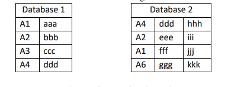
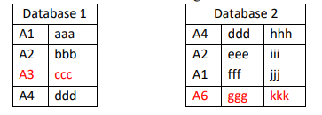

# 2022.11.12

[TOC]

## Q1

识别两个数据库之间的差异。第一列为ID列，标注出另一个库中ID不存在的行

处理前：



处理后：



要求三种情况，发生任何一种就执行：

1. 按下按钮
1. 激活指定工作表
1. 按alt+shift+f7

```vb
' 列数转字母
Function CNtoW(ByVal num As Long) As String
    CNtoW = Replace(Cells(1, num).Address(False, False), "1", "")
End Function

' 字母转列数
Function CWtoN(ByVal AB As String) As Long
    CWtoN = Range("a1:" & AB & "1").Cells.Count
End Function

' 对比列差异
Sub DifferenceComparison()

    Application.ScreenUpdating = False
    Application.Calculation = xlManual


    Dim SHEET_NAME_A As String
    Dim SHEET_NAME_B As String
    SHEET_NAME_A = "Sheet1"
    SHEET_NAME_B = "Sheet2"

    Dim countSheetAColumn As Integer
    Dim countSheetBColumn As Integer
    ' Get the last column
    countSheetAColumn = Worksheets(SHEET_NAME_A).UsedRange.Columns.Count
    countSheetBColumn = Worksheets(SHEET_NAME_B).UsedRange.Columns.Count

    ' Get the last row
    Dim countSheetARow As Integer
    Dim countSheetBRow As Integer
    countSheetARow = Worksheets(SHEET_NAME_A).UsedRange.Rows.Count
    countSheetBRow = Worksheets(SHEET_NAME_B).UsedRange.Rows.Count

    ' Debug.Print "SheetA Last Row is " & countSheetARow & " Column is " & countSheetAColumn
    ' Debug.Print "SheetB Last Row is " & countSheetBRow & " Column is " & countSheetBColumn


    Dim flagDifference As Boolean
    
    ' 设置临时选区
    Dim tmpRangeA As Range
    Dim tmpRangeB As Range
    Dim i As Integer
    Dim j As Integer


    ' 对比前重置选区无格式
    Worksheets(SHEET_NAME_A).Range("A1:" & CNtoW(countSheetAColumn) & countSheetARow).Interior.ColorIndex = 0
    Worksheets(SHEET_NAME_B).Range("A1:" & CNtoW(countSheetBColumn) & countSheetBRow).Interior.ColorIndex = 0

    ' 遍历查找SheetA差异
    For i = 1 To countSheetARow
        flagDifference = False

        For j = 1 To countSheetBRow
            If (Worksheets(SHEET_NAME_A).Range("A" & i).Value = Worksheets(SHEET_NAME_B).Range("A" & j).Value) Then
                flagDifference = True
                
                Exit For
            End If
        Next

        If (flagDifference = False) Then
            ' Worksheets(SHEET_NAME_A).Range("A" & i & ":" & CNtoW(countSheetAColumn) & i).Interior.Color = vbRed
            Worksheets(SHEET_NAME_A).Range("A" & i & ":" & CNtoW(countSheetAColumn) & i).Font.Color = vbRed
        End If

    Next


    ' 遍历查找SheetB差异
    For i = 1 To countSheetBRow
        flagDifference = False

        For j = 1 To countSheetARow
            If (Worksheets(SHEET_NAME_A).Range("A" & i).Value = Worksheets(SHEET_NAME_B).Range("A" & j).Value) Then
                flagDifference = True
                
                Exit For
            End If
        Next

        If (flagDifference = False) Then
            ' Worksheets(SHEET_NAME_A).Range("A" & i & ":" & CNtoW(countSheetBColumn) & i).Interior.Color = vbRed
            Worksheets(SHEET_NAME_B).Range("A" & i & ":" & CNtoW(countSheetBColumn) & i).Font.Color = vbRed
        End If

    Next

    Application.ScreenUpdating = True
    Application.Calculation = xlAutomatic

End Sub


' https://www.656463.com/wenda/VBAyongyubijiaoliangliedeExcel_232
Sub Validate_Metadata()
    Dim myRng As Range
    Dim lastCell As Long
    Dim flag As Boolean
    
    'Get the last row
    Dim lastRow As Integer
    lastRow = ActiveSheet.UsedRange.Rows.Count

    'Debug.Print "Last Row is " & lastRow

    Dim c As Range
    Dim d As Range

    Application.ScreenUpdating = False


    For Each c In Worksheets("Sheet1").Range("A2:A" & lastRow).Cells
        For Each d In Worksheets("Sheet2").Range("A2:A" & lastRow).Cells
            c.Interior.Color = vbRed
            flag = False
             If (InStr(1, d, c, 1) > 0) Then
                c.Interior.Color = vbWhite
                Exit For
            End If
        Next
    Next

    If (flag <> True) Then

      ActiveSheet.Range("A1:A" & lastRow).AutoFilter Field:=1, Criteria1:=RGB(255, 0 _
        , 0), Operator:=xlFilterCellColor
    End If
    
    Application.ScreenUpdating = True
End Sub


```


## Q2

写一个函数接收一个数组，运行Monte Carlo模拟方法。http://cn.voidcc.com/question/p-csgwaaxj-bdq.html

用来应对股票价格的改变。返回 最小值、中值、算术平均值和最大值。函数中包含6个参数：

1. 初始价格P
2. 股票价格上涨的概率q
3. 上涨情况的对数（logarithmic） r
4. 股票价格下降情况的logreturn值  i
5. 每次运行的步数 N
6. 确定要运行的Monte Carlo模拟的数量


## Q3

写一个function。

1. 第一个入参是一个单元格范围（也可以理解为二维数组）
2. 第二个参数是min
3. 第三个参数是max
4. 第四个参数是 boolean

这个function返回一个数组

数组的要求是

第一个参数中   大于（等于）min 且 小于（等于）max的所有值  从小到大排序

如果boolean是true  则需要把（等于）的值也算上 也就是 >=min   and   <=max

如果boolean是false  则取数逻辑是  >min  and <max

```vb
Function Question3(cellRange As Range, min As Integer, max As Integer, flag As Boolean)
    ' 动态数组定义
    Dim arr()
    
    Dim checkList As New Collection

    Dim countRangeRow As Integer
    Dim countRangeColumn As Integer

    countRangeRow = cellRange.Rows.Count
    countRangeColumn = cellRange.Columns.Count
    
    ' Debug.Print countRangeRow & "====" & countRangeColumn
    ' Debug.Print min & "====" & max & "====" & flag
    ' Debug.Print cellRange.Cells(1, 1)


    Dim tmp As Integer

    ' 查找符合条件的数据
    For i = 1 To countRangeRow
        For j = 1 To countRangeColumn
            tmp = cellRange.Cells(i, j)
        
            If flag = True Then
                If tmp >= min And tmp <= max Then
                    checkList.Add tmp
                End If
                
            Else
                If tmp > min And tmp < max Then
                    checkList.Add tmp
                End If

            End If

        Next
       
    Next

    Dim countResult As Integer
    countResult = checkList.Count
    Debug.Print countResult
    
    ' 重新定义动态数组
    ReDim arr(1 To countResult)

    Dim tmpIndex As Integer

    For i = 1 To countResult
        tmpIndex = 1
        tmp = checkList.Item(tmpIndex)
        
        For j = 2 To checkList.Count
            If checkList.Item(j) < tmp Then
                tmp = checkList.Item(j)
                tmpIndex = j
            End If

        Next

        arr(i) = tmp
        checkList.Remove tmpIndex
       
    Next

    Question3 = arr
    
End Function

```


## Q4

询问用户M（平均值）、D（标准差）、N（模拟的长度）、X（模拟运行的次数）。从用户选择的单元格开始打印每日的股票价格。打印的每日股票价格的lg(p1/p0)值，应该服从M和D的正态分布（全都是符合正态分布的随机数）。X次模拟结束后，在屏幕上打印一个单独窗口显示这些打印值的平均值。

按下某个按钮  或  Alt+ctrl+f11的时候这个sub启动

```vb

Sub abc()
    Dim tmp As Integer
    Debug.Print Application.Run; "ATPVBAEN.XLAM!Random", ActiveSheet.Range("$A$1"), , , 2 _
        , , 10, 100
        
    Application
End Sub

' https://cloud.tencent.com/developer/ask/sof/785665
' https://www.codenong.com/54382217/
Function RandNorm(Optional mean As Double = 0, Optional sd As Double = 1) As Double
    Dim r1 As Double, r2 As Double, s As Double
    r1 = Rnd()
    If r1 = 0 Then r1 = Rnd() 'no danger of two zeros in a row in rnd()
    r2 = Rnd()
    s = Sqr(-2 * Log(r1)) * Cos(6.283185307 * r2) '6.28 etc. is 2*pi
    RandNorm = mean + sd * s
End Function

Sub Question4()
    On Error GoTo line
    
    Dim m As Double, d As Double
    Dim n As Integer, x As Integer
    Dim selectRangeRow, selectRangeColumn As Integer

    Dim checkList As New Collection
    Debug.Print "==================="

    selectRangeRow = ActiveCell.Cells.Row
    selectRangeColumn = ActiveCell.Cells.Column

    m = Application.InputBox("Please enter the average value", "average value", 0)
    d = Application.InputBox("Please enter the standard deviation", "standard deviation", 1)
    n = Application.InputBox("Please enter the length of the simulation", "length of the simulation", 10)
    x = Application.InputBox("Please enter the number of simulation runs", "number of simulation runs", 10)

    Dim tmp, sum As Double
    Dim count As Integer
    count = 0

    For i = 1 To x
        tmp = RandNorm(m, d)
        If tmp > (-n) And tmp < n Then
            checkList.Add tmp
            Cells(selectRangeRow + count, selectRangeColumn) = Application.WorksheetFunction.Power(10, tmp)
            sum = sum + tmp
            count = count + 1
        End If
    Next i

    avg = sum / count
    avg = Application.WorksheetFunction.Power(10, avg)
    
    MsgBox "average value: " & avg
    
line:

End Sub


Function Question4a(m As Double, d As Double, n As Integer, x As Integer)
    ' Dim m, d As Double
    ' Dim n, x As Integer

    ' m = InputBox("Please enter the average value", "average value", "0")
    ' d = InputBox("Please enter the standard deviation", "standard deviation", "1")
    ' m = InputBox("Please enter the length of the simulation", "length of the simulation", "10")
    ' m = InputBox("Please enter the number of simulation runs", "number of simulation runs", "10")

    Dim tmp, sum, avg As Double
    Dim count As Integer
    count = 1

    For i = 1 To x
        tmp = RandNorm(m, d)
        If tmp > (-n) And tmp < n Then
            sum = sum + tmp
            count = count + 1
        End If
    Next i

    avg = sum / count

    Question4a = Application.WorksheetFunction.Power(10, avg)

End Function


```

